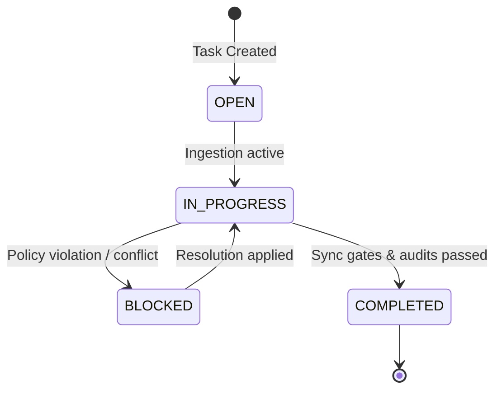

# Active Task Intelligence Model — Stayflexi Platform

This document describes the task monitoring schema, dependencies mapping rules, state indicators, and history tracking models used to manage active tasks.

---

## 1. Active Task Lifecycle & Properties

The AI Planner orchestrates tasks through a status-based lifecycle to prevent race conditions or duplicate implementations.



### `Task` Node Properties

- `id: String` (e.g. "TSK-00129")
- `title: String` (e.g. "Add corporate customerType parameter")
- `description: String`
- `status: String` (OPEN, IN_PROGRESS, BLOCKED, COMPLETED)
- `blockedReason: String` (Populated if status is BLOCKED)
- `createdAt: DateTime`
- `completedAt: DateTime`

---

## 2. Dependency & History Tracking Mappings

### Task Dependencies

Tasks can depend on the completion of prior tasks (e.g., exposing a field in GraphQL requires that the database column exists first).

- **Cypher Mapping**:
  ```cypher
  MATCH (t1:Task {id: "TSK-00129"})
  MATCH (t2:Task {id: "TSK-00130"})
  MERGE (t2)-[:DEPENDS_ON_TASK]->(t1);
  ```
- **Constraint**: If `t1.status != "COMPLETED"`, the completion gate blocks `t2` from beginning code modifications.

### Task History Tracking

Every completed task links directly to its modifications audits and commit markers:

- **Relational Mappings**:
  - `(t:Task)-[:PRODUCED_COMMIT]->(c:Commit)`
  - `(t:Task)-[:GENERATED_AUDIT]->(a:AuditEvent)`
- **Reference**: [SYNC_AUDIT_MODEL.md](file:///C:/Stayflexi/docs/discovery/SYNC_AUDIT_MODEL.md).
