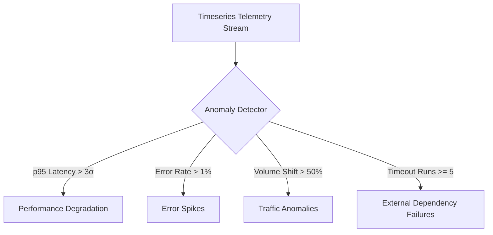

# Anomaly Detection Model — Stayflexi Platform

This document describes the algorithms, mathematical rules, metrics targets, and sliding-window parameters used by the anomaly detection engine to identify operational issues.

---

## 1. Anomaly Classifications & Detection Parameters

The anomaly detection engine continuously audits timeseries metrics fetched from Prometheus to detect four classes of anomalies.

---

## 2. Detection Specification Matrix

### 1. Performance Degradation

- **Target Metrics**: [http_request_duration_seconds](file:///C:/Stayflexi/docs/discovery/METRIC_CATALOG.md#L18), [graphql_resolver_duration_seconds](file:///C:/Stayflexi/docs/discovery/METRIC_CATALOG.md#L18).
- **Algorithm**: Exponentially Weighted Moving Average (EWMA) with standard deviations.
- **Rule Constraint**:
  $$Latency_{\text{Current}} > \mu_{\text{7-day}} + (3 \times \sigma_{\text{7-day}})$$
- **Sliding Window**: 10 minutes.
- **Action**: Fire alert warning of latency drift.

### 2. Error Spikes

- **Target Metrics**: `http_requests_total{status=~"5.."}`.
- **Algorithm**: Proportion of HTTP 5xx responses.
- **Rule Constraint**:
  $$\frac{\sum \text{Requests}_{\text{5xx}}}{\sum \text{Requests}_{\text{Total}}} > 0.01$$
- **Sliding Window**: 5 minutes.
- **Action**: Classify as potential Incident and map to parent [Endpoint](file:///C:/Stayflexi/docs/discovery/NODE_CATALOG.md#L43) node.

### 3. Traffic Anomalies

- **Target Metrics**: `http_requests_total`.
- **Algorithm**: Seasonality comparison against historical hours.
- **Rule Constraint**:
  $$\text{Volume}_{\text{Current}} < (0.50 \times \text{Volume}_{\text{Expected}}) \lor \text{Volume}_{\text{Current}} > (2.00 \times \text{Volume}_{\text{Expected}})$$
- **Sliding Window**: 1 hour.
- **Action**: Alert SRE of potential network routing blocks or DDoS incidents.

### 4. External Dependency Failures

- **Target Metrics**: [ota_sync_events_failed_total](file:///C:/Stayflexi/docs/discovery/METRIC_CATALOG.md#L42).
- **Algorithm**: Failure count threshold.
- **Rule Constraint**:
  $$\text{Consecutive Failures} \ge 5$$
- **Sliding Window**: Immediate check.
- **Action**: Fire P1 Incident, alert Channel Manager integration, and switch to cache fallback state.
