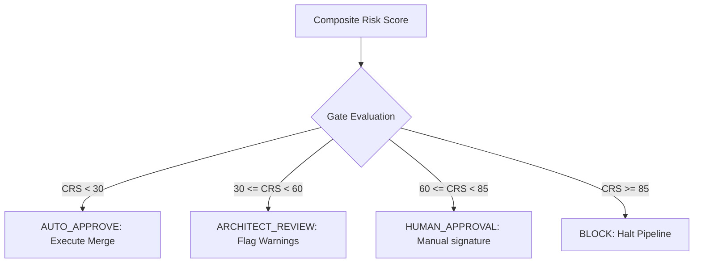

# Approval Recommendation Model — Stayflexi Platform

This document describes the automated policy actions, testing rules, and review requirements assigned to each risk classification gate.

---

## 1. Approval Gate Specifications

The risk intelligence layer maps the Composite Risk Score (CRS) directly to one of four recommendation directives.

---

## 2. Policy Enforcement Matrix

| CRS Range          | Recommendation     | Review Requirement                                                                                                                   | Minimum Testing Scope                                                                                                              | Git Pipeline Action                                           |
| :----------------- | :----------------- | :----------------------------------------------------------------------------------------------------------------------------------- | :--------------------------------------------------------------------------------------------------------------------------------- | :------------------------------------------------------------ |
| **CRS < 30**       | `AUTO_APPROVE`     | None. Automated AI verification.                                                                                                     | Basic unit testing, linter, formatting.                                                                                            | Create branch, commit edits, and auto-merge.                  |
| **30 <= CRS < 60** | `ARCHITECT_REVIEW` | Tech Lead / Sub-domain owner review warning flags.                                                                                   | E2E integration test run: [captureLiveLocalhost.test.ts](file:///C:/Stayflexi/src/tests/integration/captureLiveLocalhost.test.ts). | Create PR, tag reviewers, block auto-merge until approved.    |
| **60 <= CRS < 85** | `HUMAN_APPROVAL`   | Two Principal Architects review and sign [IMPACT_REPORT_TEMPLATE.md](file:///C:/Stayflexi/docs/discovery/IMPACT_REPORT_TEMPLATE.md). | Full integration and concurrency suites: [src/tests/](file:///C:/Stayflexi/src/tests/).                                            | Complete branch freeze. Human approval override required.     |
| **CRS >= 85**      | `BLOCK`            | Mandatory SRE / VP Engineering security audit.                                                                                       | Dry-run migration check and performance profiling.                                                                                 | Cancel task execution, abort build processes, email security. |

---

## 3. Workflow Automation Scripts

The orchestrator enforces these policies using the following rules:

### Auto-Approve Flow

- If `CRS < 30`, compile codebase, check that tests pass:
  `npm run build && npx playwright test --project=api`
- If successful, merge branch directly to master.

### Block Flow

- If `CRS >= 85`, log a security exception:
  > _"[SECURITY BLOCK] Change proposal CHG-X is flagged as CRITICAL RISK (CRS: 89). Database column drop or tenant filter bypass detected. Aborting plan."_
- Freeze git repository mutations for the target workspace.
