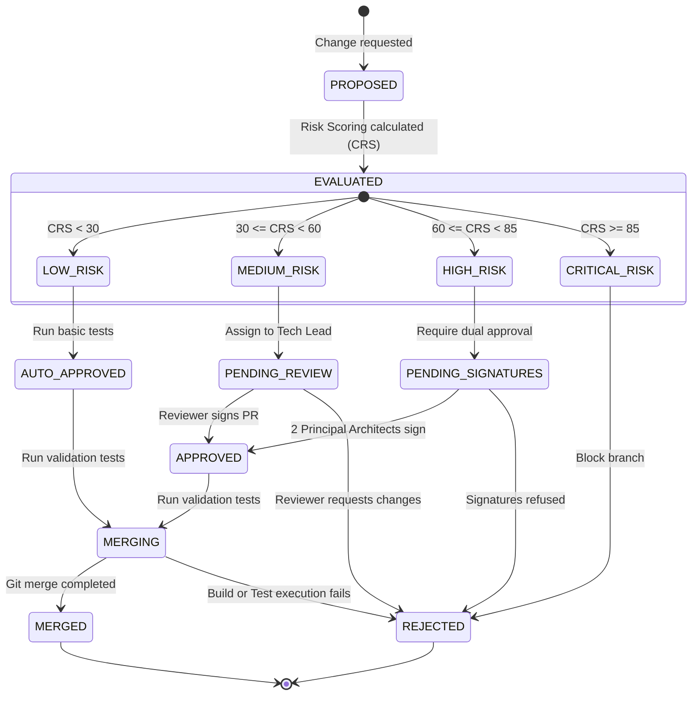

# Approval Workflow Model — Stayflexi Platform

This document describes the workflow state machine, execution transitions, reviewer notifications, and pull request rules enforced by the approval gate.

---

## 1. Approval Workflow State Machine

Proposed modifications transit through standard verification states before code is allowed to merge.

---

## 2. Notification & PR Policy

### 1. `LOW_RISK` -> Auto-Approve Flow

- **Reviewer Action**: None.
- **Git Action**: Generate branch `ai/chg-[ID]`, run format checks, commit changes, and auto-merge to `main`.

### 2. `MEDIUM_RISK` -> Architect Review Flow

- **Reviewer Action**: Notify the sub-domain Tech Lead via Slack or Email.
- **Notification Template**:
  > _"Review Request: AI has generated a MEDIUM-risk update (CRS: 48) affecting [booking.service.ts](file:///C:/Stayflexi/services/booking-service/src/booking.service.ts). PR: #284. Click to review."_
- **Merge Block**: Enforce GitHub branch protection: require 1 approving review from owner.

### 3. `HIGH_RISK` -> Human Approval Flow

- **Reviewer Action**: Freeze Git merges, write [Change Impact Report](file:///C:/Stayflexi/docs/discovery/IMPACT_REPORT_TEMPLATE.md), and email the architecture review board.
- **Merge Block**: Requires physical GPG signatures from 2 registered Principal Architects.

### 4. `CRITICAL_RISK` -> Block Flow

- **Action**: Immediately halt execution. Update PR description with details of the policy breach (e.g. attempting to alter multi-tenant database isolation criteria).
