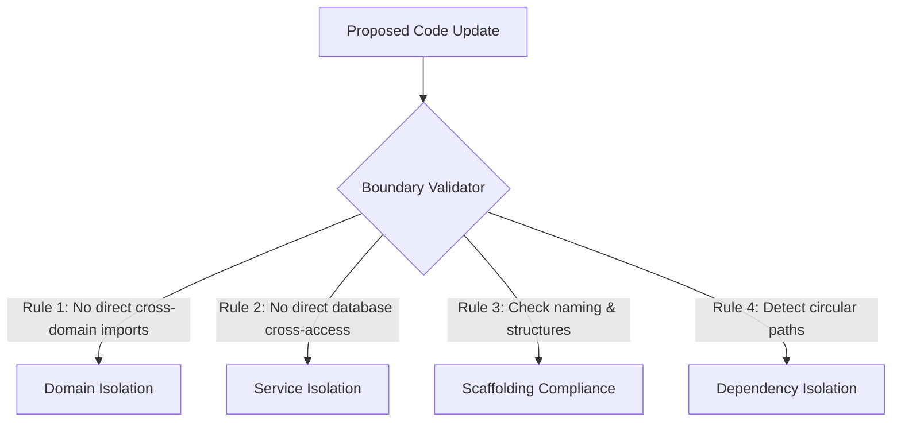

# Architecture Governance Model — Stayflexi Platform

This document describes the architectural rules, boundaries validation methods, folder layouts, and naming standards enforced by the compliance engine.

---

## 1. Domain & Service Boundaries Enforcement

To prevent architectural degradation and tight coupling, the orchestrator enforces strict vertical and horizontal isolation rules.



### 1. Domain Boundaries

- **Policy**: Modules inside the `booking` domain are isolated from the `room` or `payment` domains. Code inside `services/booking-service` must not import source files directly from `services/payment-service`.
- **Enforcement**: Run AST imports analysis during git hooks. Violations halt compilation.

### 2. Service Boundaries

- **Policy**: Microservices are containerized entities. They are forbidden from directly executing database commands against tables owned by other services. For example, `booking-service` cannot access tables defined in `room.prisma` schemas. All cross-service operations must occur via REST endpoints or GraphQL queries.
- **Reference**: [DATABASE_REGISTRY.md](file:///C:/Stayflexi/docs/discovery/DATABASE_REGISTRY.md).

---

## 2. Naming & Folder Structure Standards

The compliance validator scans workspaces directories to ensure consistency:

### Naming Standards

- **Repositories**: Must end with the suffix `Repository` (e.g., [PrismaBookingRepository](file:///C:/Stayflexi/services/booking-service/src/booking.service.ts)).
- **Data Transfer Objects**: Must end with the suffix `Dto` (e.g., `CreateBookingRequestDto`).
- **Validators**: Must end with the suffix `Validator` or `Schema` (e.g. Zod validators).

### Folder Structure Standards

Microservices under [services/](file:///C:/Stayflexi/services/) must align with the standard package folder layout:

```text
services/<service-name>/
├── src/
│   ├── controllers/
│   ├── services/
│   ├── repositories/
│   ├── dtos/
│   └── index.ts
├── package.json
└── tsconfig.json
```

---

## 3. Dependency Rules & Circular Check

- **Monorepo Hoisting**: All external npm dependencies must map to root-level package-lock structures. Services must not declare differing versions of shared packages.
- **Circular Imports Check**: The AST parser executes circular imports path traversals (e.g., using `madge`). If an import cycle is detected (e.g. `serviceA` imports `serviceB` which imports `serviceA`), the compiler rejects the commit.
