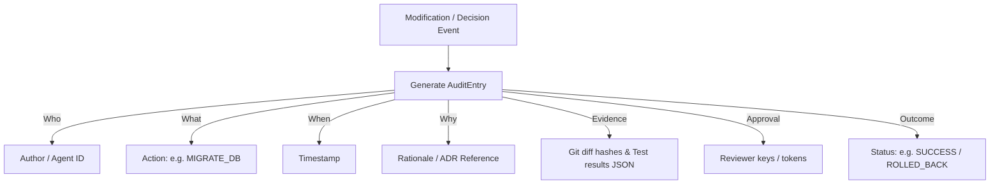

# Audit Trail Model — Stayflexi Platform

This document describes the structure, properties, verification signatures, and Neo4j mapping queries used to compile immutable audit trails for every code commit and operational decision.

---

## 1. Audit Log Properties

The compliance engine writes an [AuditEvent](file:///C:/Stayflexi/docs/discovery/NODE_CATALOG.md#L175) node to the graph for all modifications.



### Ingestion Properties

- `id: String` (Unique UUID)
- `author: String` (e.g. `ai-orchestrator-v5` or developer email)
- `actionType: String` (e.g. `SCHEMA_ALTERATION`, `CODE_MERGE`, `HOTFIX_APPLIED`)
- `timestamp: DateTime`
- `rationale: String` (Summary of why the change is necessary, mapping to ADRs)
- `evidencePath: String` (URL pointing to test run report JSON and screenshots)
- `approvedBy: String[]` (List of principal reviewers signatures)
- `outcome: String` (SUCCESS, FAILED, ROLLED_BACK)

---

## 2. Cypher Ingestion Queries

Audit entries are injected directly into the Knowledge Graph to maintain relational histories of modifications.

```cypher
MATCH (f:Feature {featureId: $featureId})
CREATE (a:AuditEvent {
  id: apoc.create.uuid(),
  author: $author,
  actionType: $actionType,
  timestamp: datetime(),
  rationale: $rationale,
  evidencePath: $evidencePath,
  approvedBy: $approvedBy,
  outcome: $outcome
})
CREATE (f)-[:MODIFIED_BY]->(a);
```

### Querying the Modification History of a Domain

To retrieve who changed a specific database table and why:

```cypher
MATCH (t:DatabaseTable {tableName: "bookings"})-[:HAS_COLUMN]->(col:DatabaseColumn)
MATCH (col)<-[:MODIFIED_COLUMN]-(a:AuditEvent)
RETURN
  a.timestamp AS Date,
  a.author AS Operator,
  a.rationale AS Reason,
  a.approvedBy AS Reviewers,
  a.outcome AS Result;
```
