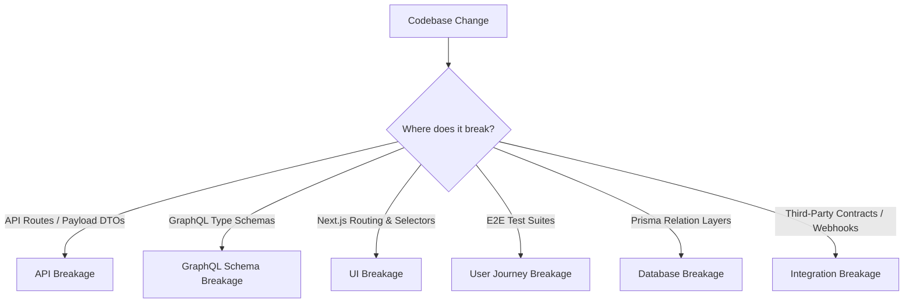

# Breakage Detection Model — Stayflexi Platform

This document describes the automated detection algorithms, compiler integrations, and validation tools used to flag structural breakages across the software layers.

---

## 1. Breakage Classifications & Detection Mechanisms

We classify software breakages into six domains and specify the toolchains used to alert the orchestrator.

---

## 2. Detection Logic & Toolchains

### API Breaks

- **Detection Method**: Compare structural payload shapes in [packages/shared-validation/](file:///C:/Stayflexi/packages/) using Zod diffing scripts.
- **Breaking Triggers**:
  - Changing request methods (e.g., converting `POST` to `PUT` on booking endpoints).
  - Adding mandatory parameters to endpoint payloads.
  - Modifying return codes or changing status JSON keys.

### Schema Breaks

- **Detection Method**: Execute Apollo Rover schema checks on code-first pothos builds:
  `npx rover subgraph check gateway-composition --schema ./schema.graphql`
- **Breaking Triggers**:
  - Deleting GraphQL types or fields.
  - Converting nullable fields to non-nullable inside resolvers.
  - Renaming query or mutation names.

### UI Breaks

- **Detection Method**: Compare selector hashes in Next.js Page views and E2E script locators.
- **Breaking Triggers**:
  - Removing or editing CSS classes (e.g., renaming `.reservation-block` to `.booking-card` when [captureLiveLocalhost.test.ts](file:///C:/Stayflexi/src/tests/integration/captureLiveLocalhost.test.ts#L9) expects `.reservation-block`).
  - Deleting layouts or page directories under [src/app/](file:///C:/Stayflexi/src/app/).

### Journey Breaks

- **Detection Method**: Run Playwright test runs and analyze output trace failures:
  `npx playwright test --project=integration`
- **Breaking Triggers**:
  - Test case assertions fail (e.g. check-out transaction throws conflict exception).
  - Remote debugger logs unhandled exceptions or timeout triggers on selector clicks.

### Database Breaks

- **Detection Method**: Format validation and Prisma migrations check:
  `npx prisma validate` and `npx prisma migrate diff`
- **Breaking Triggers**:
  - Dropping tables or renaming columns (e.g., modifying `bookings` table columns).
  - Adding non-nullable columns without defaults.
  - Changing primary or foreign keys.

### Integration Breaks

- **Detection Method**: JSON Schema validation of webhook callbacks and mock contract tests.
- **Breaking Triggers**:
  - Removing fields from callback URLs parsed by payment partners (Stripe) or channel sync APIs.
  - Changing auth header models.
