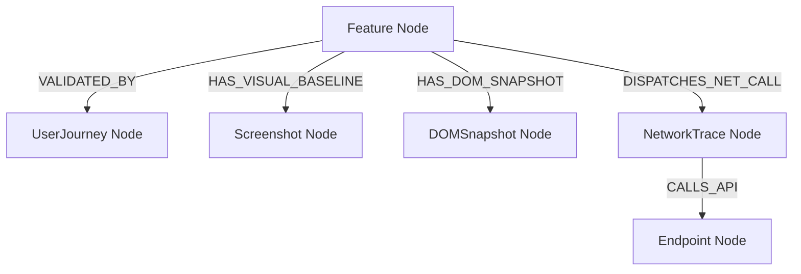

# Browser Intelligence Neo4j Integration Model — Stayflexi Platform

This document defines the Cypher mappings, properties, and relationship directions linking runtime browser findings to core application nodes.

---

## 1. Node Catalog Extensions

We introduce three telemetry nodes and one user-facing node to hold dynamic client findings:

### `Screenshot`

- **Properties**:
  - `id: String` (e.g. "SHOT-REVENUE-01")
  - `filePath: String` (Local file path inside recovery workspace)
  - `viewport: String` (e.g. "1440x900")
  - `capturedAt: DateTime`
  - `imageHash: String` (MD5 hash of visual layout)

### `DOMSnapshot`

- **Properties**:
  - `id: String` (e.g. "DOM-BOOKINGS-01")
  - `route: String` (e.g. "/bookings")
  - `htmlHash: String` (DOM tree signature)
  - `elementCount: Integer` (Count of visible interactive elements)
  - `capturedAt: DateTime`

### `NetworkTrace`

- **Properties**:
  - `id: String` (e.g. "TRACE-AUTH-01")
  - `url: String` (Requested URL path)
  - `method: String` (GET, POST, etc.)
  - `statusCode: Integer` (e.g. 200, 500)
  - `durationMs: Integer` (Latency duration)
  - `capturedAt: DateTime`

---

## 2. Graph Schema Mappings

We map discovered telemetry to static [Feature](file:///C:/Stayflexi/docs/discovery/NODE_CATALOG.md#L33) and [UserJourney](file:///C:/Stayflexi/docs/discovery/NODE_CATALOG.md#L121) nodes:



### Relationships Definition Table

| Source Node    | Relationship Type     | Target Node    | Description                                                         |
| :------------- | :-------------------- | :------------- | :------------------------------------------------------------------ |
| `Feature`      | `VALIDATED_BY`        | `UserJourney`  | Binds user-facing feature flags to simulated browser flows.         |
| `Feature`      | `HAS_VISUAL_BASELINE` | `Screenshot`   | Links visual layout tests to core features for regression auditing. |
| `Feature`      | `HAS_DOM_SNAPSHOT`    | `DOMSnapshot`  | Maps structural element signatures to features.                     |
| `Feature`      | `DISPATCHES_NET_CALL` | `NetworkTrace` | Captures API dependency traces triggered by user actions.           |
| `NetworkTrace` | `CALLS_API`           | `Endpoint`     | Maps raw client HTTP traffic to defined server-side routes.         |

---

## 3. Cypher Injection Mappings

The following Cypher scripts are executed by the ingestion engine:

### Linking User Journeys to Features

```cypher
MATCH (f:Feature {featureId: $featureId})
MERGE (uj:UserJourney {journeyName: $journeyName})
ON CREATE SET
  uj.steps = $steps,
  uj.status = "PENDING",
  uj.updatedAt = datetime()
MERGE (f)-[:VALIDATED_BY]->(uj);
```

### Ingesting Discovered Screen Captures

```cypher
MATCH (f:Feature {featureId: $featureId})
CREATE (s:Screenshot {
  id: apoc.create.uuid(),
  filePath: $filePath,
  viewport: $viewport,
  capturedAt: datetime(),
  imageHash: $imageHash
})
CREATE (f)-[:HAS_VISUAL_BASELINE]->(s);
```

### Ingesting DOM Snapshots

```cypher
MATCH (f:Feature {featureId: $featureId})
CREATE (dom:DOMSnapshot {
  id: apoc.create.uuid(),
  route: $route,
  htmlHash: $htmlHash,
  elementCount: $elementCount,
  capturedAt: datetime()
})
CREATE (f)-[:HAS_DOM_SNAPSHOT]->(dom);
```

### Ingesting Intercepted Network Traffic

```cypher
MATCH (f:Feature {featureId: $featureId})
MATCH (e:Endpoint {route: $endpointRoute, method: $method})
CREATE (nt:NetworkTrace {
  id: apoc.create.uuid(),
  url: $url,
  method: $method,
  statusCode: $statusCode,
  durationMs: $durationMs,
  capturedAt: datetime()
})
CREATE (f)-[:DISPATCHES_NET_CALL]->(nt)
CREATE (nt)-[:CALLS_API]->(e);
```
