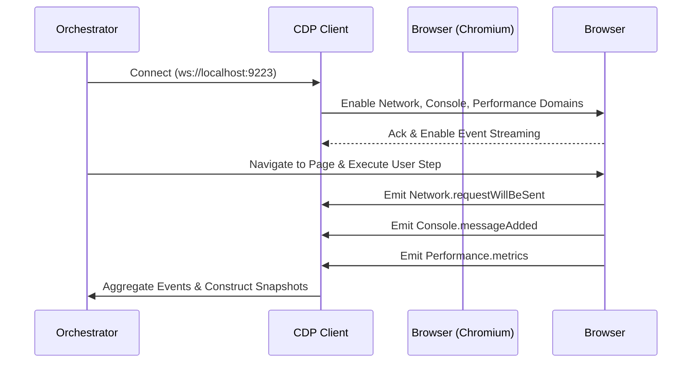

# Browser Intelligence Architecture — V5.2 Orchestrator

This document outlines the architecture, pipeline, and protocol configurations of the Browser Intelligence Layer for the Stayflexi platform.

---

## 1. High-Level Architecture Overview

The Browser Intelligence Layer provides dynamic, runtime observation of the client interface. It complements static source code analysis and backend API cataloging by running headful/headless web browsers to discover user interfaces, execute user journeys, capture network traces, and map client-side interactions.

```mermaid
graph TD
    A[AI Orchestrator / Runner] --> B[Playwright Runner]
    A --> C[Puppeteer DOM Inspector]
    B --> D[Browser Instance (Chromium)]
    C --> D
    D --> E[Chrome DevTools Protocol - CDP Port 9223]
    E --> F[Network Trace Collector]
    E --> G[Console Log Inspector]
    E --> H[DOM Snapshot & A11y Tree]
    F --> I[Graphiti Ingestion Pipeline]
    G --> I
    H --> I
    I --> J[(Neo4j Knowledge Graph)]
```

---

## 2. Playwright vs. Puppeteer Roles

To maximize automation throughput and deep inspection capability, we bifurcate browser operations:

| Capability               | Playwright                                                                                                                               | Puppeteer                                                          |
| :----------------------- | :--------------------------------------------------------------------------------------------------------------------------------------- | :----------------------------------------------------------------- |
| **Primary Focus**        | User Journey orchestration, functional flows, structured assertions.                                                                     | Deep DOM inspection, runtime element analysis, layout metrics.     |
| **Protocol Integration** | Native browser context wrapper, standard E2E APIs.                                                                                       | Direct Chrome DevTools Protocol (CDP) bindings, raw evaluation.    |
| **Debugging Port**       | Connects to running application server or starts instance.                                                                               | Attaches to existing CDP ports (e.g., `ws://localhost:9223`).      |
| **Visual Capture**       | Automated page/viewport screenshots, full-page rendering.                                                                                | Component-level visual snapshots, paint time checks.               |
| **Target Files**         | [playwright.config.ts](file:///C:/Stayflexi/playwright.config.ts), [src/tests/integration/](file:///C:/Stayflexi/src/tests/integration/) | Ingestion scripts, live DOM parsers in `platform-validation/src/`. |

---

## 3. Chrome DevTools Protocol (CDP) Integration

The orchestrator utilizes Chromium’s remote debugging protocol over port `9223` as defined in [playwright.config.ts](file:///C:/Stayflexi/playwright.config.ts).

### CDP Handshake & Event Listeners

1. **Connection Establishment**:
   - Establish websocket session: `ws://localhost:9223/devtools/browser/...`
   - Retrieve targets and filter for primary application page.
2. **Domain Activation**:
   - Enable network collection: `Network.enable`
   - Enable console monitoring: `Console.enable` and `Runtime.enable`
   - Enable accessibility auditing: `Accessibility.enable`
   - Enable performance metrics tracking: `Performance.enable`

### Protocol Flow Chart



---

## 4. Ingestion & Neo4j Integration Pipeline

Once browser telemetry (DOM trees, traces, screenshots, console logs) is captured:

1. **Artifact Storage**: Save binary files (screenshots, JSON logs, HTML trees) in the local recovery workspace.
2. **Relationship Engine**: Resolve URLs and elements to application [Page](file:///C:/Stayflexi/docs/discovery/NODE_CATALOG.md#L78) and [Endpoint](file:///C:/Stayflexi/docs/discovery/NODE_CATALOG.md#L43) nodes.
3. **Graph Injection**: Execute Cypher transactions linking `UserJourney` nodes to discovered `Screenshot`, `NetworkTrace`, and `DOMSnapshot` nodes.

> [!NOTE]
> All browser interactions and capture scripts utilize standard configurations defined under the [platform-validation](file:///C:/Stayflexi/platform-validation/) package workspace to maintain consistency.
