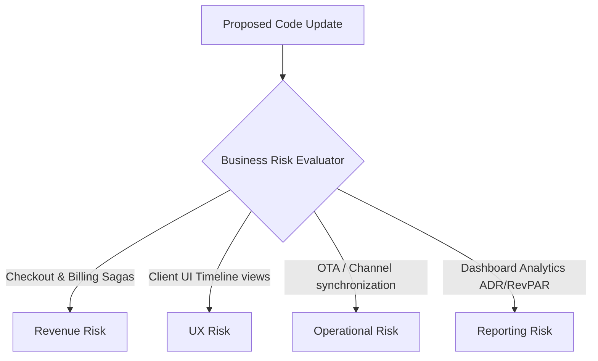

# Business Risk Model — Stayflexi Platform

This document describes the business risk classifications, operational metrics, and mitigation rules targeting Revenue, UX, Operations, and Reporting services.

---

## 1. Business Risk Domains

We evaluate four domains of business risk to ensure code modifications do not disrupt hotel guest bookings, payment ledgers, or OTA integrations.

---

## 2. Evaluation Criteria & Triggers

### 1. Revenue Risk

- **Focus**: Stripe billing API, checkout invoicing workflows, and deposit requirements.
- **Evaluation Criteria**:
  - **HIGH RISK (Score: 9.0-10.0)**: Modifying files in the checkout process saga (e.g. `payment-service` code). A bug here directly blocks hotel monetization.
  - **LOW RISK (Score: 1.0-2.0)**: Updating static page headers or changing optional guest profile fields.

### 2. User Experience (UX) Risk

- **Focus**: Web interfaces load speed, UI selector consistency, and client layout routing.
- **Evaluation Criteria**:
  - **HIGH RISK (Score: 8.0-10.0)**: Renaming core CSS class selectors used in Playwright timeline E2E suites.
  - **LOW RISK (Score: 1.0-3.0)**: Edits to secondary UI dialog layouts or localized text files.
- **Reference**: [USER_JOURNEY_MODEL.md](file:///C:/Stayflexi/docs/discovery/USER_JOURNEY_MODEL.md).

### 3. Operational Risk

- **Focus**: OTA integrations (Expedia, Booking.com) and staff channel managers.
- **Evaluation Criteria**:
  - **HIGH RISK (Score: 8.5-10.0)**: Modifying the real-time sync schedules or endpoint schemas in [otaSync.test.ts](file:///C:/Stayflexi/src/tests/integration/otaSync.test.ts). Errors here cause double-bookings.
  - **LOW RISK (Score: 1.0-3.0)**: Changing internal admin notification formatting strings.

### 4. Reporting Risk

- **Focus**: Occupancy summaries, ADR calculation scripts, and ledger analytics databases.
- **Evaluation Criteria**:
  - **HIGH RISK (Score: 7.0-9.0)**: Modifying column values in database tables which feed dashboard cards. Leads to corrupted financial reports.
  - **LOW RISK (Score: 1.0-3.0)**: Adding secondary columns that do not affect mathematical aggregations.
