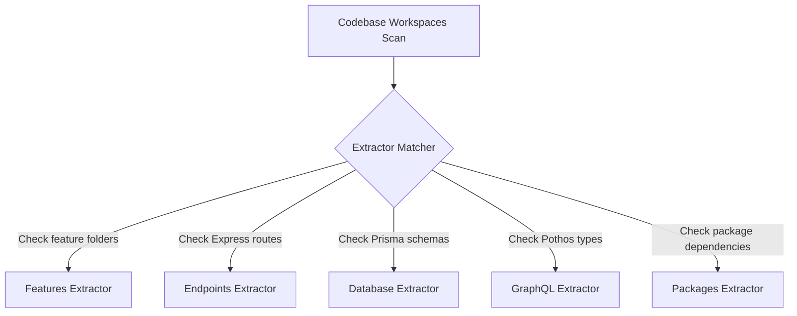

# Change Extraction Model — Stayflexi Platform

This document describes the change extraction rules, AST parsers, schema scanners, and JSON outputs used to isolate codebase modifications.

---

## 1. Extraction Sources & Rules

The Change Extraction Engine audits the codebase workspace to identify updates across eight domains.



### 1. Feature Extractor

- **Source**: [C:/Stayflexi/docs/discovery/FEATURE_REGISTRY.md](file:///C:/Stayflexi/docs/discovery/FEATURE_REGISTRY.md) and folder layouts.
- **Rule**: Scan for folder creation/deletion or changes to capability comments.

### 2. Endpoints Extractor

- **Source**: `Express` routes files (e.g. `routes.ts` or `controller.ts` files inside services).
- **Rule**: Parse routes definitions to extract HTTP method, path, and Zod validator references.

### 3. Database Extractor

- **Source**: [booking.prisma](file:///C:/Stayflexi/src/database/prisma/schema/booking.prisma) and other Prisma files.
- **Rule**: Compare Prisma model structures against the baseline. Extract table names, data type changes, or index modifications.

### 4. GraphQL Extractor

- **Source**: Code-first Pothos type resolvers files.
- **Rule**: Parse AST mappings to locate additions, drops, or type adjustments of query and mutation resolvers.

### 5. Packages Extractor

- **Source**: `package.json` configurations.
- **Rule**: Diffs dependency blocks to track whitelisted or blocked changes.

---

## 2. Ingestion Output Schema

The extraction engine outputs a standardized payload:

```json
{
  "taskId": "task-00129",
  "baselineCommit": "a1f8b2c",
  "currentCommit": "9b1fb2d",
  "changes": [
    {
      "domain": "DATABASE",
      "target": "bookings",
      "type": "COLUMN_ADD",
      "properties": {
        "columnName": "customerType",
        "dataType": "String",
        "isNullable": true
      }
    },
    {
      "domain": "GRAPHQL",
      "target": "BookingType",
      "type": "FIELD_ADD",
      "properties": {
        "fieldName": "customerType",
        "gqlType": "String"
      }
    }
  ]
}
```

This payload is forwarded to the Delta Generation Engine to establish graph relationships.
