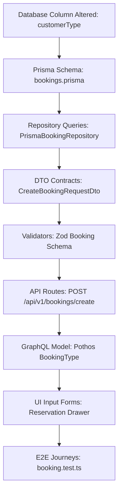

# Change Propagation Model — Stayflexi Platform

This document describes the change propagation algorithm and engine rules used to discover side-effects when changing schema variables or feature components.

---

## 1. Change Propagation Flow Engine

The propagation engine traces changes starting from the database columns up to the user-facing GraphQL types and UI elements.

---

## 2. Step-by-Step Propagation Walkthrough

Using the example where a new field `customerType` (e.g., Corporate, Retail, OTA) is added to the `bookings` table:

### Step 1: Database Columns Ingestion

- **Event**: Column added to [booking.prisma](file:///C:/Stayflexi/src/database/prisma/schema/booking.prisma).
- **Engine Rule**: Flag the parent [DatabaseTable](file:///C:/Stayflexi/docs/discovery/NODE_CATALOG.md#L87) "bookings" and register the new [DatabaseColumn](file:///C:/Stayflexi/docs/discovery/NODE_CATALOG.md#L92) "customerType".

### Step 2: Repository Layer

- **Engine Rule**: Find all repositories querying this table. The AST scanner flags `PrismaBookingRepository` because it executes queries referencing table fields.
- **Affected Nodes**: `Repository {className: "PrismaBookingRepository"}`

### Step 3: DTO Contracts

- **Engine Rule**: Check DTO definitions importing or mapping entity classes. Flag `CreateBookingRequestDto` and `BookingResponseDto` for parameter updates.
- **Affected Nodes**: `DTO {name: "CreateBookingRequestDto"}`

### Step 4: Schema Validators

- **Engine Rule**: Locate Zod schemas validation blocks that filter request bodies. Flag validator middleware to ensure the new field is allowed and sanitized.
- **Affected Nodes**: `Validator {name: "BookingValidator"}`

### Step 5: Web API Endpoints

- **Engine Rule**: Flag REST routes utilizing the validator middleware and DTOs.
- **Affected Nodes**: `Endpoint {route: "/api/v1/bookings/create", method: "POST"}`

### Step 6: GraphQL Composition

- **Engine Rule**: Check Pothos code-first builders that resolve the `Booking` entity. Flag the federated Apollo schema mapping types.
- **Affected Nodes**: `GraphQLSchema` type `BookingType`

### Step 7: UI Input Components & Reports

- **Engine Rule**: Scan JSX/TSX layout code for reservation forms. Flag the input fields drawer in the bookings dashboard. Scan reporting charts that compile revenue stats.
- **Affected Nodes**: `UIComponent {name: "ReservationFormDrawer"}`

### Step 8: E2E Playwright Tests

- **Engine Rule**: Trace tests that load the bookings dashboard and execute bookings. Flag [bookJuneRoom101.test.ts](file:///C:/Stayflexi/src/tests/integration/bookJuneRoom101.test.ts) to verify the new input option works.
- **Affected Nodes**: `PlaywrightTest {fileName: "bookJuneRoom101.test.ts"}`
