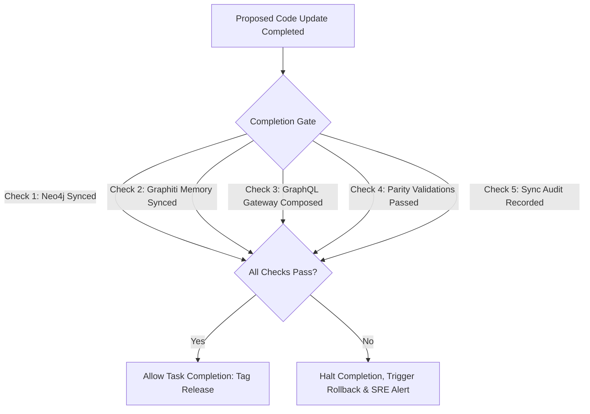

# Completion Gate Model — Stayflexi Platform

This document describes the task completion verification rules, blocking conditions, and automatic rollback scripts enforced by the synchronization gate.

---

## 1. Task Completion Validation Gate

A task is blocked from completion if any synchronization phase fails or consistency drifts.

---

## 2. Blocking Criteria & Exception Conditions

Automated task completion is aborted if any of these conditions are met:

### 1. Neo4j Ingestion Failure

- **Trigger**: Cypher transactions return database locking errors or key constraint violations.
- **Action**: Halt the pipeline. Prevent code merges.

### 2. Graphiti Memory Failure

- **Trigger**: Semantic summarization timeouts occur or vector embeddings APIs fail.
- **Action**: Halt the pipeline. Prevent code merges.

### 3. GraphQL Schema Compilation Failure

- **Trigger**: Pothos type builders throw type-checking errors, or the Apollo Rover CLI composition check fails:
  `npx rover subgraph check gateway-composition`
- **Action**: Halt the pipeline. Block pull request.

### 4. Consistency Validation Failure

- **Trigger**: Checksum mismatches between database structures and Neo4j catalog models.
- **Action**: Halt the pipeline. Mark Git commit as non-compliant.

---

## 3. Automatic Rollback & SRE Alerting Workflow

When a blocking violation occurs:

1. **Rollback Git Branch**: Discard code modifications on the target branch:
   `git checkout main && git branch -D ai/chg-[ID]`
2. **Revert Schema Migrations**: Revert database structure changes back to the original model.
3. **Log Exception**: Record the event in the audit trail:
   > _"[COMPLETION GATE BLOCK] Synchronization failed at GraphQL schema composition step. Triggered automatic rollback of branch ai/chg-129. Alerting SRE."_
