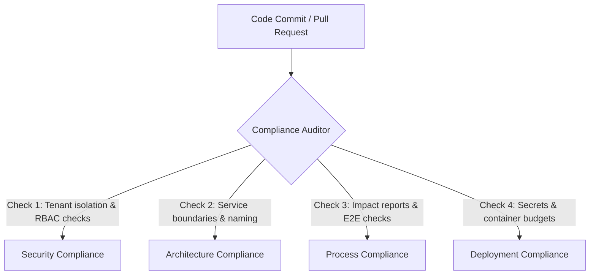

# Compliance Validation Model — Stayflexi Platform

This document describes the compliance verification models, validation checks, and automatic gates targeting Security, Architecture, Process, and Deployment standards.

---

## 1. Compliance Audit Categories

We establish four compliance auditing categories to verify code security and structural integrity.

---

## 2. Compliance Auditing Checks

### 1. Security Compliance

- **Verification Rule**: AST checks must confirm that all database write/read queries reference the `organizationId` selector.
- **Access Rule**: Endpoints marked `isAuthRequired: true` must map to valid JWT validating wrappers.
- **Reference**: [SECURITY_INVENTORY.md](file:///C:/Stayflexi/docs/discovery/SECURITY_INVENTORY.md).

### 2. Architecture Compliance

- **Verification Rule**: Pre-commit linting verifies naming conventions (`*Repository.ts`, `*Dto.ts`) and directory placement.
- **Boundary Rule**: Cross-domain imports (e.g. imports between stateless services folders) are blocked.
- **Reference**: [ARCHITECTURE_GOVERNANCE_MODEL.md](file:///C:/Stayflexi/docs/discovery/ARCHITECTURE_GOVERNANCE_MODEL.md).

### 3. Process Compliance

- **Verification Rule**: The orchestrator verifies that a complete change report matches the commit payload before execution.
- **Testing Gate**: E2E browser tests suites must yield a 100% success rate:
  `npx playwright test --project=integration`
- **Reference**: [PLAYWRIGHT_STRATEGY.md](file:///C:/Stayflexi/docs/discovery/PLAYWRIGHT_STRATEGY.md).

### 4. Deployment Compliance

- **Verification Rule**: Audit Kubernetes config configurations to ensure all environmental variables are mapped to secure secrets.
- **Resource Gate**: Verify CPU/Memory limits do not exceed namespace capacities defined in Helm configs.
