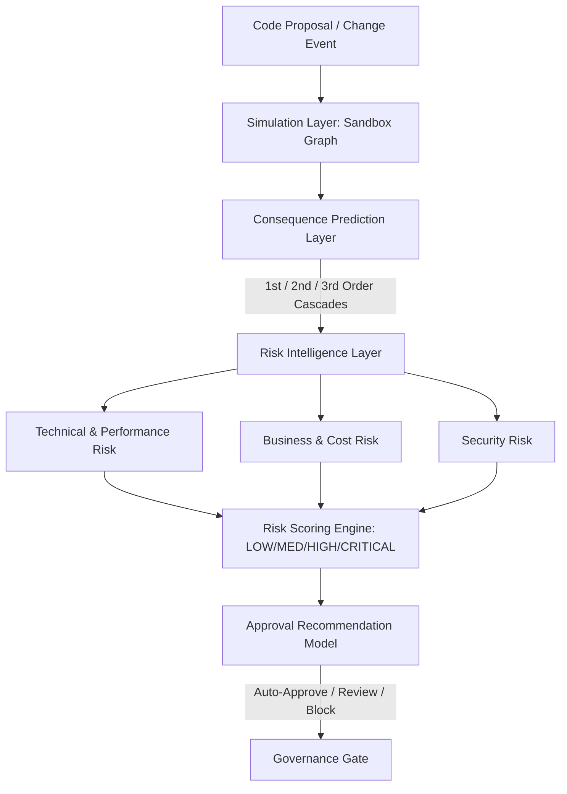

# Consequence Prediction & Risk Intelligence Architecture — Stayflexi Platform

This document describes the design of the Consequence Prediction, Risk Intelligence, and Graph Simulation layers for the V5.2 Orchestrator.

---

## 1. High-Level Engine Architecture

The Risk Intelligence engine simulates code proposals on a mock sandbox graph, predicts multi-order consequences, aggregates risks, and decides the approval recommendation.

---

## 2. Layer Specifications

### Simulation Layer (Sandbox Graph)

- **Purpose**: Creates an isolated runtime clone of the active Neo4j graph schemas to execute dry-run schema edits.
- **Workflow**: Clones target nodes and applies proposed edits (e.g., adding `customerType` column or altering GraphQL resolver logic). Evaluates if any existing paths are severed or if query traversal bounds fail.

### Consequence Prediction Layer

- **Purpose**: Traces paths from the simulated edit to predict direct and transitive downstream failures.
- **Workflow**: Runs path traversal queries and cross-checks with historical failure logs cached in [RUNTIME_MEMORY_MODEL.md](file:///C:/Stayflexi/docs/discovery/RUNTIME_MEMORY_MODEL.md) to discover latent dependencies.

### Risk Intelligence Layer

- **Purpose**: Translates predicted failures into concrete operational, technical, performance, and financial parameters.
- **Workflow**: Formulates score metrics, evaluates potential cost overheads, and compiles a comprehensive change impact report using [IMPACT_REPORT_TEMPLATE.md](file:///C:/Stayflexi/docs/discovery/IMPACT_REPORT_TEMPLATE.md).
