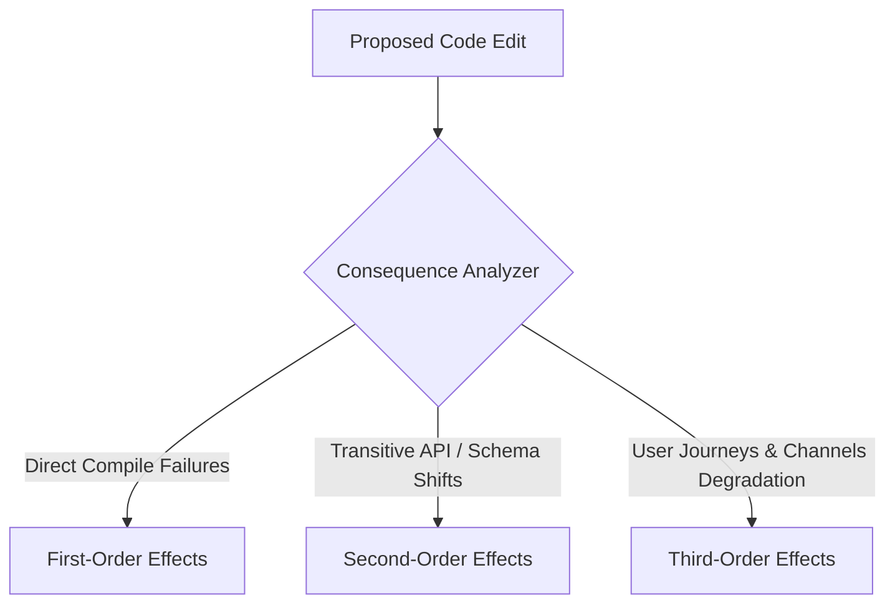

# Consequence Prediction Model — Stayflexi Platform

This document describes the multi-order consequence classification system used to predict compile-time, gateway, runtime, and business-critical failures during change intelligence evaluations.

---

## 1. Structured Consequence Cascades

When a change is simulated, the orchestrator evaluates three layers of downstream effects.

---

## 2. Dynamic Impact Scenarios

To illustrate the model, we trace the consequence cascades of two common engineering alterations:

### Scenario A: Adding `customerType` Column to `bookings` Table

- **First-Order (Direct) Consequences**:
  - Requires updating the Prisma client layout via `npx prisma generate`.
  - Compile errors occur if [PrismaBookingRepository](file:///C:/Stayflexi/services/booking-service/src/booking.service.ts) attempts to map model fields strictly without the new column type.
- **Second-Order (Transitive) Consequences**:
  - The request validators in [packages/shared-validation/](file:///C:/Stayflexi/packages/) require adjustments to allow the parameter.
  - GraphQL subgraph composition fails if the code-first Pothos type `BookingType` does not expose or map the new field correctly.
  - Connection pooling latency increases slightly during database write phases if default values require resolution checks.
- **Third-Order (Systemic) Consequences**:
  - E2E check-in tests like [bookJuneRoom101.test.ts](file:///C:/Stayflexi/src/tests/integration/bookJuneRoom101.test.ts) fail if they submit payloads missing the mandatory new parameter.
  - Revenue dashboards ([Report](file:///C:/Stayflexi/docs/discovery/NODE_CATALOG.md#L78) metrics) aggregate NULL records for corporate stats, generating skewed ADR values.
  - Channels manager fails to sync booking data with Airbnb if payload translators do not accommodate the new property.

### Scenario B: Renaming `.reservation-block` Selector in Booking Layout

- **First-Order (Direct) Consequences**:
  - CSS style sheet compiler breaks if references to the selector are dangling.
- **Second-Order (Transitive) Consequences**:
  - Next.js layout client-side rendering engine maps wrong components classes, resulting in paint time overheads.
- **Third-Order (Systemic) Consequences**:
  - Playwright browser integration tests like [captureLiveLocalhost.test.ts](file:///C:/Stayflexi/src/tests/integration/captureLiveLocalhost.test.ts#L9) throw element selector timeout exceptions.
  - Guest booking journey fails E2E validation gates, blocking release tags.
