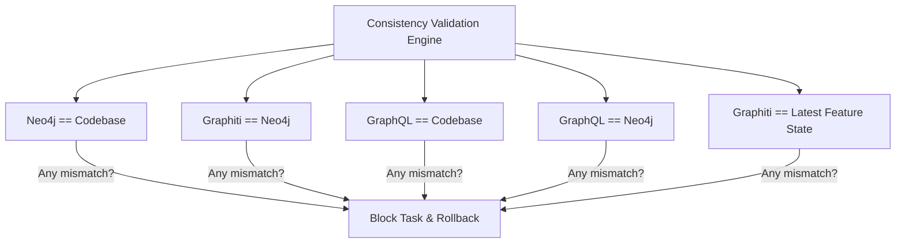

# Consistency Validation Model — Stayflexi Platform

This document describes the multi-directional audit verification rules, schema checksum algorithms, and validation queries used to confirm consistency across repositories, graphs, memories, and schemas.

---

## 1. Multi-Directional Parity Audits

To prevent stale data, the validation engine checks five parity scopes on task completion.

---

## 2. Validation Methods & Algorithms

### 1. Neo4j == Codebase

- **Goal**: Confirm the graph represents the current code layout.
- **Validation Method**: Diffs Prisma model structures and Express route arrays against Neo4j node properties.
- **Check Rule**:
  `MATCH (t:DatabaseTable {tableName: "bookings"})-[:HAS_COLUMN]->(c:DatabaseColumn)`
  The returned column list must exactly match the Prisma client properties parsed from [booking.prisma](file:///C:/Stayflexi/src/database/prisma/schema/booking.prisma).

### 2. Graphiti == Neo4j

- **Goal**: Confirm semantic memories map to physical graph telemetry.
- **Validation Method**: Semantic query check.
- **Check Rule**: For every active [Incident](file:///C:/Stayflexi/docs/discovery/NODE_CATALOG.md#L136) node in Neo4j, Graphiti must return a semantic memory when queried:
  `await graphiti.search("Incident [INC-ID]")`
  The response must not be null.

### 3. GraphQL == Codebase

- **Goal**: Confirm the GraphQL schema matches REST interfaces and DTO validation types.
- **Validation Method**: Comparison of parameters shapes.
- **Check Rule**: Diff the Pothos code-first compiled types schema against parameters declared inside Zod schemas in [packages/shared-validation/](file:///C:/Stayflexi/packages/).

### 4. GraphQL == Neo4j

- **Goal**: Confirm federated fields have corresponding API records.
- **Validation Method**: Matching GraphQL queries to REST/gRPC paths.
- **Check Rule**: For every query schema type exposed at the Apollo gateway, verify there is a corresponding [Endpoint](file:///C:/Stayflexi/docs/discovery/NODE_CATALOG.md#L43) node inside Neo4j.

### 5. Graphiti == Latest Feature State

- **Goal**: Verify memory awareness matches Git commit state.
- **Validation Method**: Semantic comparison.
- **Check Rule**: Compare features status values in [FEATURE_REGISTRY.md](file:///C:/Stayflexi/docs/discovery/FEATURE_REGISTRY.md) against retrieved Graphiti feature evolution summaries.
