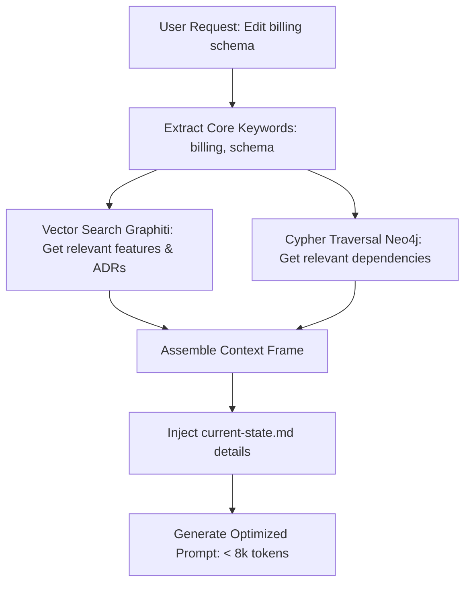

# Context Compression Model — Stayflexi Platform

This document describes the context compression algorithm, semantic pruning rules, and token optimization metrics used to build compact prompt frames.

---

## 1. Relevance Ingestion & Pruning Architecture

To prevent context window bloat and minimize token consumption during queries, the Context Builder retrieves only the dependencies connected to the active task.

---

## 2. Dynamic Pruning Rules

Instead of reading the entire codebase layout and catalogs, the engine applies four pruning filters:

### 1. Relevant Features Filter

- **Policy**: Filter [FEATURE_REGISTRY.md](file:///C:/Stayflexi/docs/discovery/FEATURE_REGISTRY.md) to include only the active feature being modified (e.g. `FEAT-BILL-01`) and direct child capabilities. Omit unrelated features.

### 2. Relevant Decisions Filter

- **Policy**: Query Graphiti memory to pull only the ADRs linked to the active features.
- **Query**:
  `MATCH (d:Decision)-[:AFFECTS]->(f:Feature {featureId: $activeFeatureId}) RETURN d`

### 3. Relevant Dependencies Filter

- **Policy**: Limit dependency listings to first and second-order direct couplings. Ignore global libraries lists.
- **Reference**: [DEPENDENCY_INTELLIGENCE_MODEL.md](file:///C:/Stayflexi/docs/discovery/DEPENDENCY_INTELLIGENCE_MODEL.md).

### 4. Relevant Active Tasks Filter

- **Policy**: Load details only for the current task (`status: "IN_PROGRESS"`) and direct task dependencies. Ignore completed sprint histories.

---

## 3. Token Optimization Comparison

| Context Model              | Prompt Sizing (Tokens) | Latency / Load Time | Financial Cost (Gemini API) | Accuracy / Performance                |
| :------------------------- | :--------------------- | :------------------ | :-------------------------- | :------------------------------------ |
| **Full Project Hydration** | 120,000+               | ~12.5s              | $0.35 per prompt            | High latency. High token decay rates. |
| **Compressed Context**     | 5,000 - 8,000          | ~1.5s               | $0.02 per prompt            | High focus. Immediate recovery times. |
