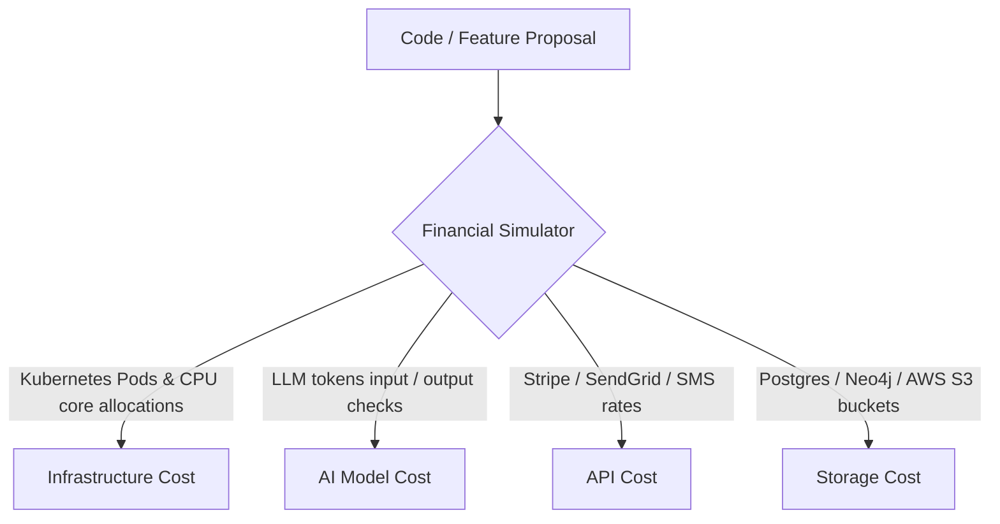

# Cost Impact Model — Stayflexi Platform

This document describes the financial cost projection formulas, metrics parameters, and calculations targeting Infrastructure, AI Model, API, and Storage overheads.

---

## 1. Cost Category Formulations

We formulate financial projection parameters across four operational scopes to evaluate changes before execution.

---

## 2. Cost Projection Formulations

### Infrastructure Cost (IC)

- **Focus**: Pod counts, Kubernetes CPU limits, and node scaling.
- **Formula**:
  $$IC_{\text{Monthly}} = \left( N_{\text{NewPods}} \times \$25.00 \right) + \left( \Delta\text{CPUCores} \times \$15.00 \right)$$
- **Variables**:
  - $N_{\text{NewPods}}$: Additional microservice container instances required.
  - $\Delta\text{CPUCores}$: Change in allocated CPU limits.

### AI Model Cost (AC)

- **Focus**: LLM token consumption by orchestrator agents and Graphiti.
- **Formula**:
  $$AC_{\text{Step}} = \left( \text{Tokens}_{\text{Input}} \times \$0.0000025 \right) + \left( \text{Tokens}_{\text{Output}} \times \$0.0000100 \right)$$
- **Variables**:
  - Tokens count checked against Gemini API rate matrices. Includes prompt context sizing.

### API Transactional Cost (APC)

- **Focus**: Paid third-party network channels (Stripe, SendGrid, Twilio).
- **Formula**:
  $$APC_{\text{Monthly}} = \left( N_{\text{Billing}} \times \$0.30 \right) + \left( N_{\text{SyncCalls}} \times \$0.02 \right) + \left( N_{\text{SMS}} \times \$0.0075 \right)$$
- **Variables**:
  - $N_{\text{Billing}}$: Total payment gateway calls.
  - $N_{\text{SyncCalls}}$: OTA channel sync operations.

### Storage Cost (SC)

- **Focus**: PostgreSQL row size expansion, Neo4j nodes metrics, and S3 screenshot buckets.
- **Formula**:
  $$SC_{\text{Monthly}} = \left( \text{Size}_{\text{DB}} \times \$0.15 \right) + \left( \text{Size}_{\text{Media}} \times \$0.023 \right)$$
- **Variables**:
  - $\text{Size}_{\text{DB}}$: Database storage size (GB).
  - $\text{Size}_{\text{Media}}$: Discovered screenshots/traces stored (GB).
