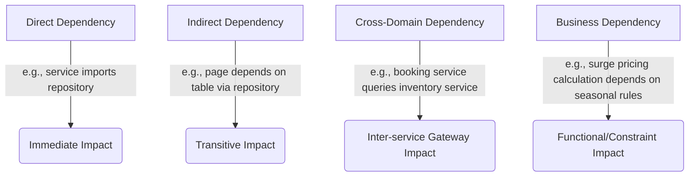

# Dependency Intelligence Model — Stayflexi Platform

This document details the classification, logic, and extraction strategies used to identify direct, indirect, cross-domain, and business-level dependencies across the Stayflexi platform codebase.

---

## 1. Classification of Dependencies

We analyze four classes of dependencies to prevent system breakages when refactoring code or changing schema variables.

---

## 2. Dependency Resolution Specifications

### Direct Dependencies

- **Definition**: Immediate coupling where Node A imports, inherits, or direct calls Node B.
- **Examples**:
  - `booking-service` imports `PrismaBookingRepository` in [booking.service.ts](file:///C:/Stayflexi/services/booking-service/src/booking.service.ts).
  - [playwright.config.ts](file:///C:/Stayflexi/playwright.config.ts) directly targets files in the [tests/](file:///C:/Stayflexi/src/tests/) directory.
- **Trace Type**: `(A)-[:DIRECT_DEP]->(B)`

### Indirect (Transitive) Dependencies

- **Definition**: Transitive relationships where Node A is connected to Node C via one or more intermediate nodes (A → B → C).
- **Examples**:
  - The bookings timeline page [page.tsx](file:///C:/Stayflexi/src/app/bookings/page.tsx) calls the search endpoint, which queries the database table `bookings`. A change in the database structure transitively impacts the page.
- **Trace Type**: `(A)-[:CALLS]->(B)-[:QUERIES]->(C)`

### Cross-Domain Dependencies

- **Definition**: Coupling across service or package namespaces (e.g. inter-service communication or sharing internal packages).
- **Examples**:
  - `booking-service` calling `inventory-service` to lock a room slot during checkout.
  - Services depending on the shared validators library located at `packages/shared-validation`.
- **Trace Type**: `(ServiceA)-[:CALLS_REMOTE]->(ServiceB)` or `(ServiceA)-[:DEPENDS_ON_PACKAGE]->(Package)`

### Business Dependencies

- **Definition**: Constraints where operational processes or rules depend on other business parameters.
- **Examples**:
  - The [BusinessCapability](file:///C:/Stayflexi/docs/discovery/NODE_CATALOG.md#L19) "Dynamic Pricing Surge" relies on active [BusinessRule](file:///C:/Stayflexi/docs/discovery/NODE_CATALOG.md#L24) values (e.g. `RULE-WKND-SURGE`).
- **Trace Type**: `(Capability)-[:DEPENDS_ON_RULE]->(Rule)`

---

## 3. Extraction Rules & Ingestion Log

To build the dependency graph:

1. **Import Analyzer**: Run typescript AST tools (`ts-morph`) across service directories to extract package imports and class instantiations.
2. **Prisma Relation Resolver**: Parse Prisma schema relations (e.g., `@relation` attributes) to establish database-level integrity dependencies.
3. **Gateway Interceptor**: Parse Apollo Federation router compositions to trace GraphQL gateway schema dependencies.
