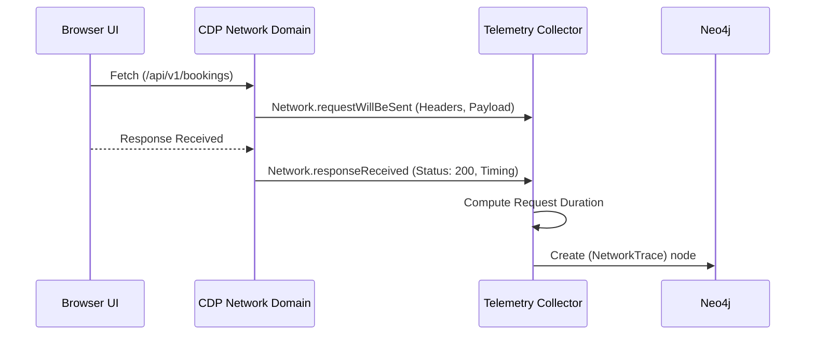

# Chrome DevTools Protocol Telemetry Strategy — Stayflexi Platform

This document describes the methods used to capture network, console, and performance logs directly from the browser window session.

---

## 1. Network Telemetry Capture Strategy

By monitoring runtime network requests, the orchestrator maps frontend dependencies to actual backend API routes and resolves GraphQL endpoint queries.

### CDP Subscribed Events

- `Network.requestWillBeSent`: Fired when a network request is initiated. Used to record URL, HTTP method, payload structures, headers, and request timestamp.
- `Network.responseReceived`: Fired when an HTTP response is returned. Logs status codes (e.g. 200, 404, 500), payload types, and size.
- `Network.loadingFinished`: Used to compute round-trip latency values.

### Network Interception Flow



---

## 2. Console Log Auditing

Console events are parsed to capture application bugs, failed authorization triggers, or API call timeouts.

### CDP Subscribed Events

- `Console.messageAdded`: Collects traditional standard console messages.
- `Runtime.consoleAPICalled`: Gathers console executions with trace frames.
- `Runtime.exceptionThrown`: Captures unhandled promise rejections and script runtime crashes.

### Filtering & Categorization Logic

Console events are automatically mapped to severity weights:

- `error`: Logged immediately to `ErrorEvent` nodes and linked to the active [UserJourney](file:///C:/Stayflexi/docs/discovery/NODE_CATALOG.md#L121) or UI component.
- `warning`: Flagged as potential regressions.
- `info` / `debug`: Suppressed unless verbose profiling modes are active.

---

## 3. Browser Performance & Web Vitals Telemetry

Performance profiling assists in identifying frontend loading bottlenecks and memory leakage.

### Standard Web Vitals Tracked

1. **LCP (Largest Contentful Paint)**: Measures load speed (target < 2.5s).
2. **FID (First Input Delay)**: Measures interactivity delay (target < 100ms).
3. **CLS (Cumulative Layout Shift)**: Measures visual stability (target < 0.1).

### Runtime Metrics Retrieval

We poll or query the `Performance.getMetrics` API to collect:

- **JSHeapUsedSize**: Tracks memory footprints during large timeline rendering operations.
- **LayoutCount**: Identifies redundant, expensive layout paints.
- **TaskDuration**: Highlights blocking main-thread executions.

```typescript
const metrics = await page.metrics()
const heapSize = metrics.JSHeapUsedSize
const layoutDuration = metrics.LayoutDuration
```

These parameters are stored in [RuntimeMetric](file:///C:/Stayflexi/docs/discovery/NODE_CATALOG.md#L150) nodes in Neo4j.
