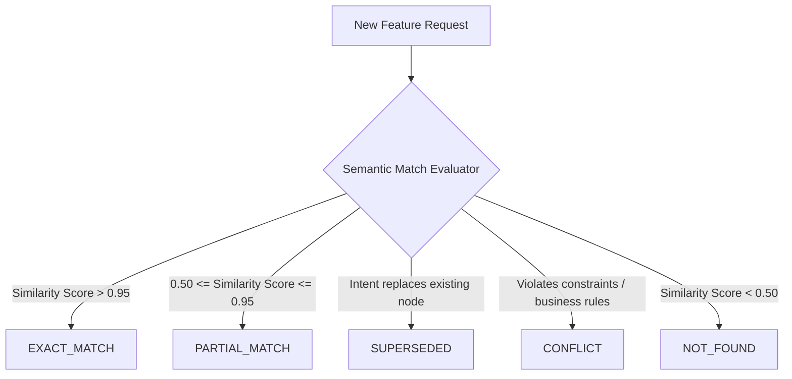

# Duplicate Feature Intelligence Model — Stayflexi Platform

This document describes the semantic and relational matching rules used by the orchestrator to detect duplicate, superseded, or conflicting feature requests before writing new code.

---

## 1. Intent Matching & Similarity States

When an agent or developer requests the implementation of a feature (e.g. "Implement a logout mechanism"), the orchestrator evaluates the requested capability against the [FEATURE_REGISTRY.md](file:///C:/Stayflexi/docs/discovery/FEATURE_REGISTRY.md) and Neo4j node catalog.

The engine classifies matching results into one of five states:

---

## 2. Match State Specification Matrix

### `EXACT_MATCH`

- **Definition**: The requested capability is fully implemented by an existing feature node.
- **Criteria**:
  - Semantic vector similarity of descriptions > 95%.
  - Shared API endpoints and target UI routes.
- **Orchestrator Action**: Reject the request. Map the task to the existing node (e.g., link query requests directly to `FEAT-AUTH-LOGOUT`).

### `PARTIAL_MATCH`

- **Definition**: The request overlaps significantly with an existing feature, but introduces new variables or constraints.
- **Criteria**:
  - Semantic similarity score between 50% and 95%.
- **Orchestrator Action**: Alert the user. Suggest expanding the existing feature rather than creating a new module. (e.g., add parameters to `/bookings/checkout` instead of building `/bookings/checkout-corporate`).

### `SUPERSEDED`

- **Definition**: The requested feature is designed as a direct replacement/upgrade of an existing, legacy feature.
- **Criteria**:
  - Business capability overrides old rules.
- **Orchestrator Action**: Write a new [Feature](file:///C:/Stayflexi/docs/discovery/NODE_CATALOG.md#L33) node. In Neo4j, create a `(new:Feature)-[:SUPERSEDES]->(old:Feature)` relationship and mark the old feature status as "DEPRECATED".

### `CONFLICT`

- **Definition**: The request violates active business rules, database constraints, or system logic.
- **Criteria**:
  - Rule incompatibility detected via impact graph traversal.
  - For example, requesting "Disable authorization checks on bookings route" conflicts with `isAuthRequired: true` on the bookings [Endpoint](file:///C:/Stayflexi/docs/discovery/NODE_CATALOG.md#L43) node.
- **Orchestrator Action**: Hard Block. Trigger an architecture exception and request manual resolution.

### `NOT_FOUND`

- **Definition**: The capability represents entirely new functionality.
- **Criteria**:
  - Semantic similarity score < 50%.
- **Orchestrator Action**: Approve the request and initiate standard generation scaffold procedures.
