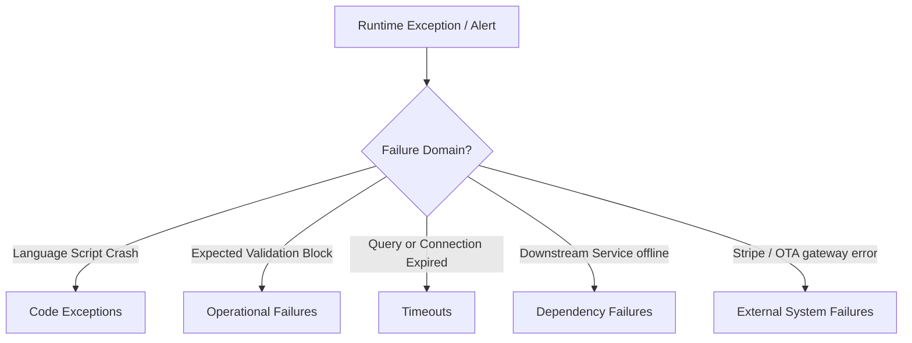

# Error Intelligence Model — Stayflexi Platform

This document describes the classifications, collection boundaries, and metadata structure of runtime failures tracked by the Error Intelligence engine.

---

## 1. Failure Taxonomy & Tracking Boundaries

The orchestrator registers five categories of runtime operational failures.

---

## 2. Ingestion Schemas & Ingress Specs

For every intercepted failure, the Pino log analyzer generates an [ErrorEvent](file:///C:/Stayflexi/docs/discovery/NODE_CATALOG.md#L155) node in Neo4j with standardized attributes:

### 1. Exceptions

- **Scope**: Javascript/TypeScript runtime crashes.
- **Example Trace**: `TypeError: Cannot read properties of null (reading 'bookingId')` at `CheckoutController.ts`.
- **Properties**: `errorClass: String`, `message: String`, `stackTrace: String`, `severity: String` (CRITICAL).

### 2. Operational Failures

- **Scope**: Handled business logic rejections (e.g. overbooking checks, validation errors).
- **Example Trace**: `ZodValidationError: Invalid checkin date` at [packages/shared-validation/](file:///C:/Stayflexi/packages/).
- **Properties**: `errorClass: String`, `fieldErrors: String[]`, `httpStatus: Integer` (400 / 422).

### 3. Timeouts

- **Scope**: Execution durations exceeding thread limits.
- **Example Trace**: `PrismaClientInitializationError: Connection timeout` at [PrismaBookingRepository](file:///C:/Stayflexi/services/booking-service/src/booking.service.ts).
- **Properties**: `timeoutLimitMs: Integer`, `elapsedMs: Integer`, `queryTarget: String`.

### 4. Dependency Failures

- **Scope**: Broken connections between internal microservices.
- **Example Trace**: `FetchError: request to http://room-service:3006/api/rooms failed` at `booking.service.ts`.
- **Properties**: `sourceService: String`, `targetService: String`, `actionCode: String`.

### 5. External System Failures

- **Scope**: Integration failure with payment gateways or OTA channels.
- **Example Trace**: `StripeAPIError: Connection refused` or `OTAHandler: OTA Sync Handshake Failed` at `otaSync.ts`.
- **Properties**: `systemName: String` (Stripe / Booking.com), `statusCode: Integer`, `payloadSent: String`.
