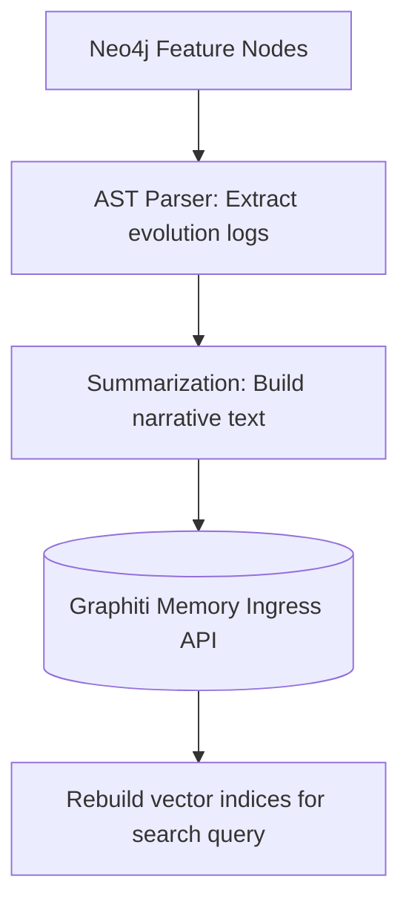

# Feature Evolution Memory Model — Stayflexi Platform

This document describes how the Graphiti Memory Layer stores and queries semantic narratives detailing feature creation, version iterations, and relationship modifications.

---

## 1. Feature Ingestion to Graphiti Memory

While Neo4j handles strict node relationships, Graphiti translates structural updates into natural language descriptions of feature progression.

---

## 2. Ingestion Statement Schemas

For every stage in a feature's lifecycle, the orchestrator records standard semantic memories:

### 1. Feature Creation

- **Trigger**: New [Feature](file:///C:/Stayflexi/docs/discovery/NODE_CATALOG.md#L33) registered.
- **Narrative Schema**:
  > _"Feature [FEATURE-ID] ([FEATURE-NAME]) was created on [DATE]. Description: [DESCRIPTION]. It implements [REQUIREMENT-ID] and exposes endpoints [ENDPOINTS]."_

### 2. Feature Updates

- **Trigger**: New [FeatureVersion](file:///C:/Stayflexi/docs/discovery/NODE_CATALOG.md#L38) node created in Neo4j.
- **Narrative Schema**:
  > _"Feature [FEATURE-ID] was updated to version [VERSION] on [DATE]. Change log: [CHANGELOG]. Modified files: [FILES]."_

### 3. Feature Deprecation

- **Trigger**: Feature marked `status: "Deprecated"`.
- **Narrative Schema**:
  > _"Feature [FEATURE-ID] was deprecated on [DATE]. Reason: [REASON]. It is superseded by [NEW-FEATURE-ID]."_

### 4. Feature Relationships Update

- **Trigger**: Establishing new couplings with other features or external systems.
- **Narrative Schema**:
  > _"Feature [FEATURE-A-ID] now depends on Feature [FEATURE-B-ID] to resolve [CAPABILITY-NAME]."_

---

## 3. Querying Evolution Memory

During planning or recovery phases, the Context Builder retrieves these memories to reconstruct how a module evolved:

- **Vector Search Query**:
  `await graphiti.search("evolution of billing feature")`
- **Returned Summary**:
  > _"Historical Summary: Feature FEAT-BILL-01 (Guest Billing Ledger) was created in v1.0.0 on 2024-01-10. It was refactored in v2.0.0 to support corporate invoicing. In v2.1.0 (2026-06-20), a new field customerType was added to filter ledgers."_
