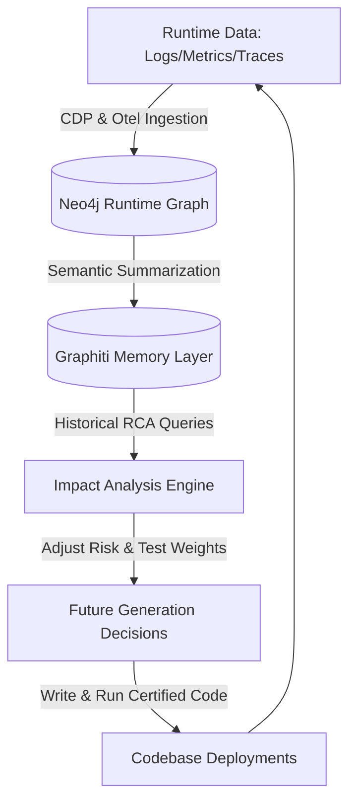

# Runtime Feedback Loop Model — Stayflexi Platform

This document describes the design of the closed-loop optimization system that feeds runtime telemetry back into code-generation, impact-analysis, and architectural decision models.

---

## 1. Closed-Loop Feedback Architecture

The orchestrator shifts from static assumptions to empirical evidence by routing runtime findings directly back into the planning layers.



---

## 2. Feedback Loop Pipeline Steps

### Step 1: Runtime Data Generation & Scraping

- Microservices write JSON Pino logs and expose Prometheus metrics.
- OpenTelemetry spans record execution times for sagas (e.g. guest check-in/checkout).

### Step 2: Neo4j Ingestion

- Real-time adapters write [RuntimeMetric](file:///C:/Stayflexi/docs/discovery/NODE_CATALOG.md#L150) and [ErrorEvent](file:///C:/Stayflexi/docs/discovery/NODE_CATALOG.md#L155) nodes.
- Establish relationships: `(Endpoint)-[:GENERATES]->(ErrorEvent)`.

### Step 3: Graphiti Memory Compilation

- The memory agent processes incident logs daily to extract long-term operational learnings.
- Graphiti links performance bottlenecks to specific code locations.

### Step 4: Enhancing the Impact Analysis Engine

- When an engineer proposes a change, the engine queries the memory:
  ```typescript
  const pastEvents = await graphiti.search('bookings schema alteration impact')
  ```
- If past data reveals that altering the bookings database structure previously caused a P0 checkout incident, the engine automatically escalates the **Technical Risk** score.

### Step 5: Optimizing Future Decisions & Testing

- Based on the risk rating, the orchestrator adjusts its validation criteria:
  - Requires manual architect review instead of automatic merges.
  - Generates specialized concurrency tests targeted at the historical failure points.
  - Automatically provisions fallback safety scripts.
