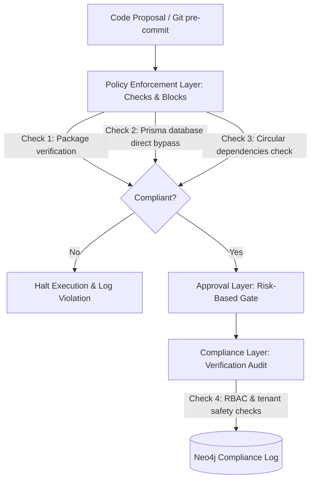

# Governance & Compliance Architecture — Stayflexi Platform

This document describes the architectural layout, pipeline gates, and policy engine structures of the Governance, Approval, and Policy Enforcement Layer.

---

## 1. High-Level Architecture Pipeline

The Governance Layer intercepts code, dependency, and database schema updates before execution to ensure alignment with defined architectural standards and security policies.

---

## 2. Layer Specifications

### Policy Enforcement Layer

- **Purpose**: Strict enforcement gate that blocks violations before builds.
- **Workflow**: Runs as a Git pre-commit hook or AST validator. Detects circular imports, unauthorized library additions, direct SQL database commands, and changes that skip impact analysis.

### Approval Layer

- **Purpose**: Evaluates change proposals against risk brackets and handles authorization workflows.
- **Workflow**: Evaluates risk profiles defined in [RISK_SCORING_ENGINE.md](file:///C:/Stayflexi/docs/discovery/RISK_SCORING_ENGINE.md). Enforces auto-approval, architect signatures, or hard blocks.

### Compliance Layer

- **Purpose**: Monitors long-term adherence to architectural and deployment standards.
- **Workflow**: Evaluates if microservice boundaries are crossed, checks database schema filters (`organizationId`), and updates metadata files inside docs folders.

### Governance Layer

- **Purpose**: Defines policies, registers owners, and tracks modifications in the audit trail.
- **Workflow**: Manages requirement versioning and registers approved packages.
