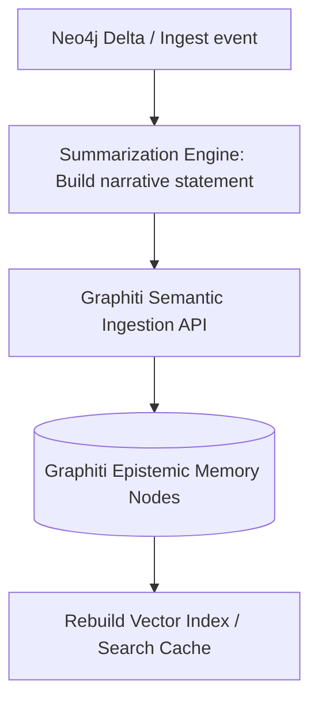

# Graphiti Memory Synchronization Model — Stayflexi Platform

This document describes the semantic ingestion logic, narrative construction rules, and search indices updates used to synchronize Graphiti memory nodes.

---

## 1. Graphiti Memory Sync Pipeline

Graphiti operates at a semantic level. When a codebase or database change occurs, raw relationship modifications are summarized into natural language statements and ingested.

---

## 2. Ingestion Rules & Narrative Schemas

### 1. Memory Nodes Updates

- **Source**: Discovered codebase drifts.
- **Narrative Format**:
  > _"As of [TIMESTAMP], the repository [PrismaBookingRepository](file:///C:/Stayflexi/services/booking-service/src/booking.service.ts) has been updated to query the new table column `customerType` in `bookings`._

### 2. Operational Decisions Synchronization

- **Source**: ADR documents (`docs/design/**/*.md`) and [DECISION_MEMORY_MODEL.md](file:///C:/Stayflexi/docs/discovery/DECISION_MEMORY_MODEL.md).
- **Narrative Format**:
  > _"Decision [DECISION-ID] was approved on [DATE]. Rationale: Expose customerType field in GraphQL subgraphs to allow reporting filters."_

### 3. Feature Evolution Synchronization

- **Source**: Feature version shifts and [FEATURE_EVOLUTION_MODEL.md](file:///C:/Stayflexi/docs/discovery/FEATURE_EVOLUTION_MODEL.md).
- **Narrative Format**:
  > _"Feature FEAT-BOOK-CREATE has evolved to version v2.1.0, adding corporate customer booking capability, superseding the v2.0.0 legacy checkout rule."_

### 4. Change Impact Reports Ingestion

- **Source**: Compiled [Change Impact Reports](file:///C:/Stayflexi/docs/discovery/IMPACT_REPORT_TEMPLATE.md).
- **Narrative Format**:
  > _"Impact Report for change proposal CHG-129 computed a Technical Risk score of 45. Affected systems: booking-service, timeline component, and bookings database table."_

### 5. Runtime Outcomes Synchronization

- **Source**: Incident post-mortems and resolved [ErrorEvents](file:///C:/Stayflexi/docs/discovery/NODE_CATALOG.md#L155).
- **Narrative Format**:
  > _"Incident INC-20260620-001 was resolved on [TIMESTAMP]. Mitigation required indexing room ID fields to prevent query connection timeouts."_
