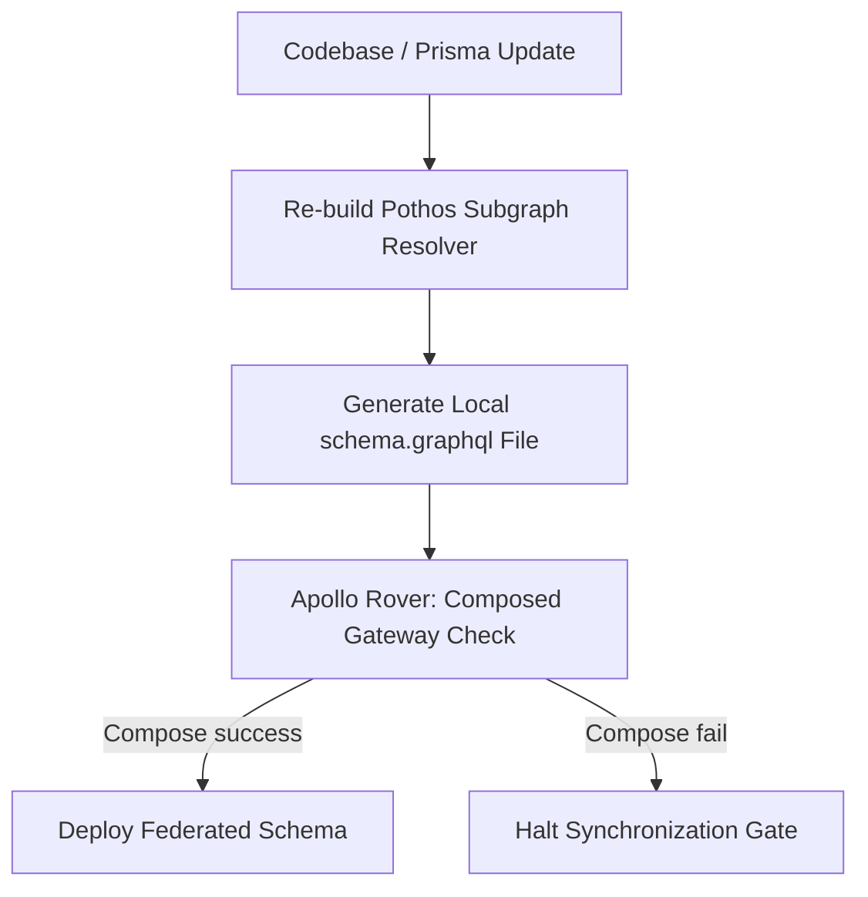

# GraphQL Synchronization Model — Stayflexi Platform

This document describes the schema compilation processes, types updates, resolvers validation, and API contracts checks used to synchronize the GraphQL gateway.

---

## 1. GraphQL Gateway Sync Flow

When backend endpoints or database structures change, code-first Pothos schemas compile subgraphs to update the Apollo Federation Gateway.



---

## 2. Ingestion & Synchronization Rules

### 1. Schema & Types Synchronization

- **Scope**: Rebuilding typescript types mapping to database tables.
- **Workflow**:
  - Prisma client models update.
  - Pothos core builders import modified Prisma models.
  - Adding `customerType` column automatically triggers exposing the property on the pothos `BookingType` GraphQL definition.

### 2. Queries & Mutations Synchronization

- **Queries Update**: Sync parameters (e.g., query inputs) to allow filtering.
- **Mutations Update**: Sync input DTOs. If a field is added to a database table, update the corresponding GraphQL input payload contract:
  ```graphql
  input CreateBookingInput {
    guestName: String!
    guestEmail: String!
    customerType: String # Added nullable field
  }
  ```

### 3. Resolvers & Fetch Validation

- **Scope**: Ensuring resolving logic matches database database query interfaces.
- **Verification Rule**: Verify that queries inside Pothos builders reference active methods inside repository classes (e.g., resolver calls `PrismaBookingRepository.createBooking(...)`).

### 4. API Contracts Audit

- **Scope**: Aligning Zod validation schemas with GraphQL types.
- **Verification Rule**: Diff Zod parameters in [packages/shared-validation/](file:///C:/Stayflexi/packages/) against GraphQL query input specifications. If parameter types or validation rules conflict, fail the gateway gate.
