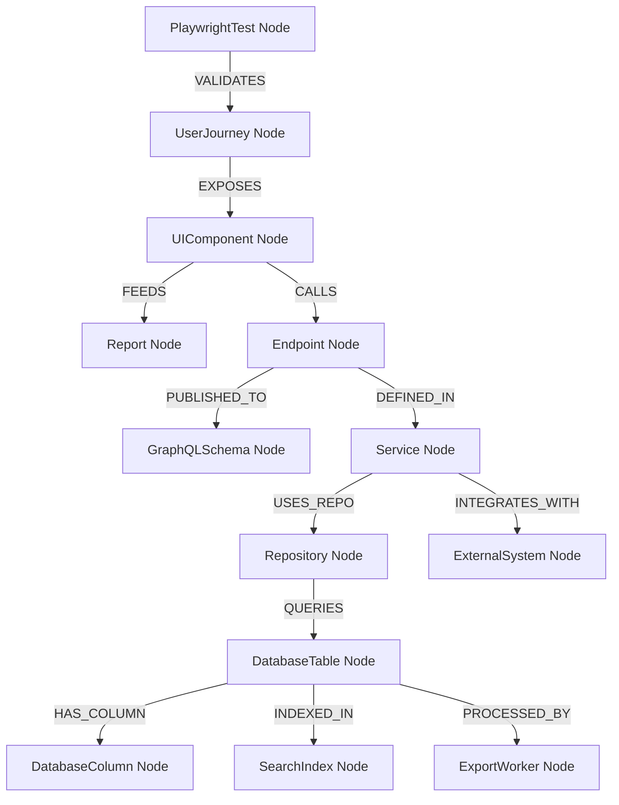

# Impact Graph Model — Stayflexi Platform

This document designs the graph traversal models, relationship semantics, and recursive Cypher queries used to trace code alterations down to affected services, database layers, frontends, and external channels.

---

## 1. Graph Traversal Path Architecture

We represent the dependencies across vertical layers (from user journey down to database columns) and horizontal layers (from internal APIs to external interfaces).



---

## 2. Dependency Traversal Matrix

The impact engine traces dependencies bidirectionally using specialized traversals:

| Source Node (Change) | Traversal Direction   | Target Node                    | Traversal Relationship                 |
| :------------------- | :-------------------- | :----------------------------- | :------------------------------------- |
| `DatabaseColumn`     | Upstream (Affected)   | `Repository`                   | `[:HAS_COLUMN]<-[:QUERIES]<-`          |
| `Repository`         | Upstream (Affected)   | `Service`, `Endpoint`          | `[:USES_REPO]<-[:DEFINED_IN]<-`        |
| `Endpoint`           | Upstream (Affected)   | `GraphQLSchema`, `UIComponent` | `[:PUBLISHED_TO]->`, `[:CALLS]<-`      |
| `UIComponent`        | Upstream (Affected)   | `UserJourney`, `Report`        | `[:EXPOSES]<-`, `[:FEEDS]->`           |
| `UserJourney`        | Upstream (Affected)   | `PlaywrightTest`               | `[:VALIDATES]<-`                       |
| `DatabaseTable`      | Downstream (Affected) | `SearchIndex`, `ExportWorker`  | `[:INDEXED_IN]->`, `[:PROCESSED_BY]->` |

---

## 3. Cypher Traversal Queries for Impact Identification

The orchestrator executes recursive queries to list all nodes downstream of an alteration.

### Query 1: Column Change Upstream Impact (Database -> UI/Tests)

This query flags all entities affected by altering a Prisma schema column (e.g. `bookings.customerType`):

```cypher
MATCH (col:DatabaseColumn {name: $columnName})<-[:HAS_COLUMN]-(t:DatabaseTable)
MATCH path = (t)<-[:QUERIES|USES_REPO|DEFINED_IN|CALLS|EXPOSES|VALIDATES*1..7]-(affected)
RETURN
  labels(affected) AS EntityType,
  affected.id AS EntityId,
  affected.name AS EntityName,
  [n in nodes(path) | labels(n)[0]] AS PropagationPath;
```

### Query 2: Feature Update Downstream Impact (Feature -> API -> Database -> Third Party)

This query flags what is touched by modifying a [Feature](file:///C:/Stayflexi/docs/discovery/NODE_CATALOG.md#L33):

```cypher
MATCH (f:Feature {featureId: $featureId})
OPTIONAL MATCH (f)-[:VALIDATED_BY]->(uj:UserJourney)
OPTIONAL MATCH (f)-[:EXPOSES]->(e:Endpoint)
OPTIONAL MATCH (e)-[:DEFINED_IN]->(s:Service)
OPTIONAL MATCH (s)-[:INTEGRATES_WITH]->(ext:ExternalSystem)
OPTIONAL MATCH (s)-[:USES_REPO]->(r:Repository)-[:QUERIES]->(t:DatabaseTable)
RETURN
  f.name AS Feature,
  collect(DISTINCT uj.journeyName) AS AffectedJourneys,
  collect(DISTINCT e.route) AS AffectedEndpoints,
  collect(DISTINCT s.name) AS AffectedServices,
  collect(DISTINCT ext.name) AS AffectedIntegrations,
  collect(DISTINCT t.tableName) AS AffectedTables;
```
