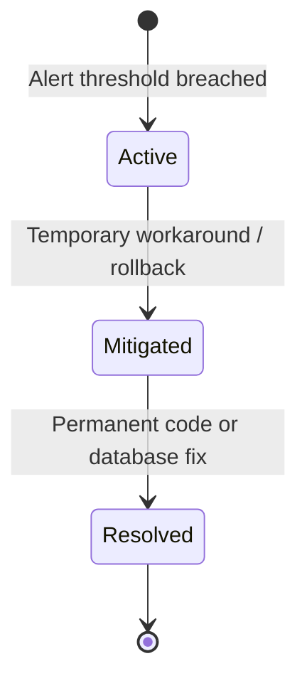

# Incident Management Model — Stayflexi Platform

This document describes the incident lifecycle tracking schema, severity categories, root cause analysis rules, and affected-user mapping specifications.

---

## 1. Incident Lifecycle & Properties

Incidents represent serious operational degradations. The orchestrator tracks them using the following data states:

### `Incident` Node Properties

- `id: String` (e.g. "INC-20260620-001")
- `summary: String` (e.g. "Overbooking occurrences due to database write connection locks")
- `status: String` (Active, Mitigated, Resolved)
- `severity: String` (P0, P1, P2, P3)
- `createdAt: DateTime`
- `resolvedAt: DateTime`
- `impactedOrgsCount: Integer` (Count of affected hotel properties)

---

## 2. Severity Classification Matrix

We establish four incident severity classifications:

| Severity | Target Response | Definition / Operational Impact                                             | Example Scenario                                              |
| :------- | :-------------- | :-------------------------------------------------------------------------- | :------------------------------------------------------------ |
| **P0**   | immediate       | Critical core transaction system outage. Guest cannot checkout or register. | Payments connection crash in `payment-service` throwing 500s. |
| **P1**   | < 1 hour        | Core capability degraded without direct workarounds.                        | Booking calendar fails to display on the Next.js timelines.   |
| **P2**   | < 4 hours       | Secondary capability degraded but workarounds exist.                        | PDF invoice generators timeout during email confirmations.    |
| **P3**   | < 24 hours      | Non-blocking visual glitches or reporting delay issues.                     | Revenue metrics cards on the dashboard load with 30s delays.  |

---

## 3. Root Cause Analysis (RCA) & Resolution Mapping

When an incident is created:

1. **RCA Identification**: The engine traverses the dependency graph back to recent change event commits or database migrations.
2. **Resolution Logging**: Record the mitigation actions (e.g., commit rollback, DB column modification).
3. **Graph Relationship**: Connect the Incident node to the root cause:
   - `(i:Incident)-[:ROOT_CAUSE_IS]->(c:Change)` or `(i:Incident)-[:ROOT_CAUSE_IS]->(col:DatabaseColumn)`

---

## 4. Affected Features & Affected Users Mapping

The impact of an incident is calculated by mapping dependencies:

- **Affected Features**:
  `MATCH (i:Incident)-[:AFFECTS]->(f:Feature)`
  This lists user-facing [Feature](file:///C:/Stayflexi/docs/discovery/NODE_CATALOG.md#L33) nodes that are currently broken or degraded.
- **Affected Users**:
  `MATCH (i:Incident)-[:IMPACTED_USER_JOURNEY]->(uj:UserJourney)`
  Identifies active customer flows currently failing Playwright browser checks (e.g. Checkout Journey).
