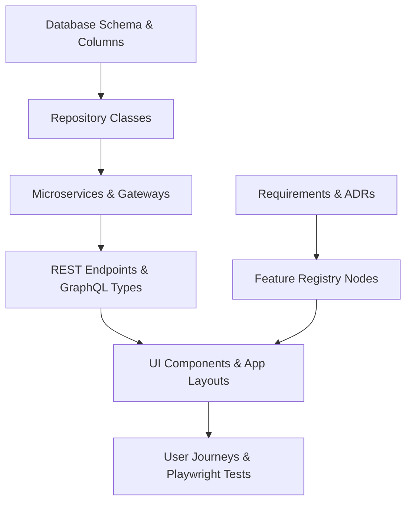

# Neo4j Synchronization Model — Stayflexi Platform

This document describes the property updates, transaction orders, and Cypher merge procedures used to synchronize all graph entities with the active codebase.

---

## 1. Node Update Sequence

To preserve relational integrity constraints, the Neo4j Synchronization Engine applies updates in a topological hierarchy:



---

## 2. Entity Sync Cypher Templates

### 1. Requirements Ingestion

- **Source**: Specification files.
- **Merge Logic**:
  ```cypher
  MERGE (r:Requirement {id: $reqId})
  SET
    r.title = $title,
    r.description = $description,
    r.priority = $priority,
    r.owner = $owner,
    r.updatedAt = datetime();
  ```

### 2. Features Ingestion

- **Source**: [FEATURE_REGISTRY.md](file:///C:/Stayflexi/docs/discovery/FEATURE_REGISTRY.md).
- **Merge Logic**:
  ```cypher
  MERGE (f:Feature {featureId: $featureId})
  SET
    f.name = $name,
    f.status = $status,
    f.description = $description,
    f.updatedAt = datetime();
  ```

### 3. Endpoints Ingestion

- **Source**: Express route handler registration files.
- **Merge Logic**:
  ```cypher
  MERGE (e:Endpoint {route: $route, method: $method})
  SET
    e.isAuthRequired = $isAuthRequired,
    e.updatedAt = datetime();
  ```

### 4. Services Ingestion

- **Source**: Microservice workspace names and ports.
- **Merge Logic**:
  ```cypher
  MERGE (s:Service {name: $serviceName})
  SET
    s.port = $port,
    s.framework = $framework,
    s.language = $language;
  ```

### 5. Repositories Ingestion

- **Source**: Repositories typescript classes.
- **Merge Logic**:
  ```cypher
  MERGE (rep:Repository {className: $className})
  SET
    rep.dataSource = $dataSource,
    rep.updatedAt = datetime();
  ```

### 6. Database Ingestion

- **Source**: Prisma [\*.prisma](file:///C:/Stayflexi/src/database/prisma/schema/) schema files.
- **Merge Logic**:
  ```cypher
  MERGE (t:DatabaseTable {tableName: $tableName})
  SET t.schemaOwner = $schemaOwner
  WITH t
  UNWIND $columns AS col
  MERGE (c:DatabaseColumn {name: col.name})
  SET
    c.dataType = col.dataType,
    c.isNullable = col.isNullable
  MERGE (t)-[:HAS_COLUMN]->(c);
  ```

### 7. UI Components Ingestion

- **Source**: Next.js app pages and layouts.
- **Merge Logic**:
  ```cypher
  MERGE (ui:UIComponent {name: $componentName})
  SET
    ui.fileLocation = $fileLocation,
    ui.selectors = $selectors;
  ```

### 8. User Journeys Ingestion

- **Source**: E2E browser tests reports and [USER_JOURNEY_MODEL.md](file:///C:/Stayflexi/docs/discovery/USER_JOURNEY_MODEL.md).
- **Merge Logic**:
  ```cypher
  MERGE (uj:UserJourney {journeyName: $journeyName})
  SET
    uj.steps = $steps,
    uj.status = $status,
    uj.updatedAt = datetime();
  ```
