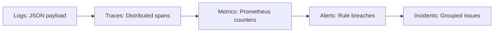

# Observability Model — Stayflexi Platform

This document details the tracking structures, event properties, and schema parameters for logs, metrics, traces, alerts, and incidents across the Stayflexi workspace.

---

## 1. Observability Schema Definition

The orchestrator standardizes observability variables into five primary categories to enable real-time ingestion into the Neo4j Runtime Graph.



### 1. Metrics Schema

- **Data Shape**: Time-series name, labels (key-value pairs), value, and timestamp.
- **Example Ingestion**:
  ```json
  {
    "metricName": "http_request_duration_seconds_bucket",
    "labels": {
      "service": "booking-service",
      "route": "/api/v1/bookings/create",
      "status": "200",
      "le": "0.5"
    },
    "value": 142.0,
    "timestamp": "2026-06-20T19:15:56Z"
  }
  ```

### 2. Logs Schema

- **Data Shape**: Pino JSON structured line including trace IDs, log levels, messages, and optional context.
- **Example Ingestion**:
  ```json
  {
    "level": 50,
    "time": 1782012000000,
    "pid": 4822,
    "hostname": "booking-pod-a",
    "serviceName": "booking-service",
    "traceId": "t-00129-ab992",
    "spanId": "s-88219-c",
    "msg": "Database query timeout during check-out lock",
    "err": {
      "type": "PrismaClientKnownRequestError",
      "message": "Query timeout exceeded on table bookings",
      "stack": "..."
    }
  }
  ```

### 3. Traces Schema

- **Data Shape**: Distributed tracing traces containing multi-service spans.
- **Properties**: `traceId: String`, `spanId: String`, `parentSpanId: String`, `name: String`, `durationMs: Integer`, `service: String`.

### 4. Alerts Schema

- **Data Shape**: Threshold breach events.
- **Properties**: `alertId: String`, `name: String`, `metricEvaluated: String`, `threshold: String`, `firedAt: DateTime`, `severity: String`.

### 5. Incidents Schema

- **Data Shape**: Operational occurrences affecting user-facing capabilities.
- **Properties**: `incidentId: String`, `summary: String`, `severity: String` (P1, P2, P3), `createdAt: DateTime`, `resolvedAt: DateTime`, `rootCauseId: String`.
