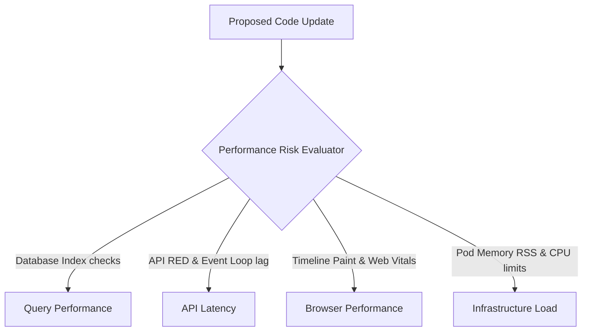

# Performance Risk Model — Stayflexi Platform

This document describes the performance risk evaluation categories, profiling metrics, and threshold constraints targeting Query, API, Browser, and Infrastructure workloads.

---

## 1. Performance Risk Domains

We evaluate four domains of performance risk to prevent new code from degrading query latency, locking browser rendering threads, or overloading container resources.

---

## 2. Evaluation Criteria & Profiling Rules

### 1. Query Performance

- **Focus**: PostgreSQL index utilization and Prisma query lock limits.
- **Evaluation Criteria**:
  - **HIGH RISK (Score: 8.5-10.0)**: Executing filters on tables (e.g., `bookings`) without leveraging a primary key or date index, or locking table rows across multi-step sagas.
  - **LOW RISK (Score: 1.0-3.0)**: Running simple key-value reads utilizing indexes.
  - **Reference**: [PrismaBookingRepository](file:///C:/Stayflexi/services/booking-service/src/booking.service.ts).

### 2. API Latency

- **Focus**: HTTP duration percentiles and event loop blocks.
- **Evaluation Criteria**:
  - **HIGH RISK (Score: 8.0-10.0)**: Calling external services (e.g., Stripe API) synchronously within the request-response thread, or creating N+1 resolver loops in pothos files.
  - **LOW RISK (Score: 1.0-3.0)**: Dispatched asynchronous background tasks or lightweight cache reads.
  - **Reference**: [METRIC_CATALOG.md](file:///C:/Stayflexi/docs/discovery/METRIC_CATALOG.md#L18).

### 3. Browser Performance

- **Focus**: Largest Contentful Paint (LCP) and Next.js client-side rendering.
- **Evaluation Criteria**:
  - **HIGH RISK (Score: 7.5-9.0)**: Re-rendering the timeline grid container continuously on date shifts, causing heavy DOM nodes counts (> 1500 nodes).
  - **LOW RISK (Score: 1.0-3.0)**: Optimizing layout using virtualization or debounce hooks.
  - **Reference**: [PUPPETEER_STRATEGY.md](file:///C:/Stayflexi/docs/discovery/PUPPETEER_STRATEGY.md#L45).

### 4. Infrastructure Load

- **Focus**: Container memory working sets and CPU core usage.
- **Evaluation Criteria**:
  - **HIGH RISK (Score: 8.0-10.0)**: Provisioning infinite loop intervals or high-memory file processing operations (e.g. PDF generation, large CSV exports).
  - **LOW RISK (Score: 1.0-3.0)**: Stateless, low-memory routing modifications.
