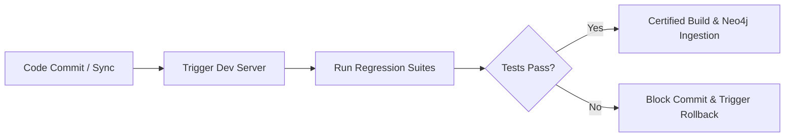

# Playwright Validation Strategy — Stayflexi Platform

This document describes the Playwright execution model used to validate application pages, routes, accessibility rules, and system behavior under load or modification.

---

## 1. Functional Testing Execution Model

Functional tests verify specific business capabilities by running isolated browser sequences.

### Test Directories & Configurations

- **Location**: [src/tests/integration/](file:///C:/Stayflexi/src/tests/integration/)
- **Configuration File**: [playwright.config.ts](file:///C:/Stayflexi/playwright.config.ts)
- **Execution Command**: `npx playwright test --project=integration`

### Active Functional Suites

- **Booking Sequence**: Enacts room allocations, ensuring check-in/check-out calendar logic works without cell overlaps. See [bookJuneRoom101.test.ts](file:///C:/Stayflexi/src/tests/integration/bookJuneRoom101.test.ts).
- **Authentication Gateway**: Verifies login redirection, session token expiration, and secure route isolation. See [testLogoutLogin.test.ts](file:///C:/Stayflexi/src/tests/integration/testLogoutLogin.test.ts).
- **OTA Synchronization**: Simulates mock external API updates (e.g. Booking.com, Airbnb) and asserts real-time state changes inside the room grid. See [otaSync.test.ts](file:///C:/Stayflexi/src/tests/integration/otaSync.test.ts).

---

## 2. Regression Testing Strategy

To guarantee that codebase modifications do not degrade existing functions, the orchestrator triggers regression suites on every GraphQL schema compile, Neo4j update, or Git pull.

### Regression Pipeline



### Key Areas Inspected during Regression

1. **API Schema Integrity**: Assert that frontend payloads match updated Zod endpoints.
2. **State Concurrency**: Verify that double-bookings throw appropriate 409 conflict validation errors.

---

## 3. Accessibility (A11y) Testing

We implement automated accessibility tests using `@axe-core/playwright` to evaluate compliance with WCAG 2.1 AA guidelines.

### Integration Schema

```typescript
import { test, expect } from '@playwright/test'
import AxeBuilder from '@axe-core/playwright'

test('Accessibility Audit - Bookings Page', async ({ page }) => {
  await page.goto('/bookings')
  await page.waitForSelector('.reservation-grid')

  const results = await new AxeBuilder({ page }).withTags(['wcag2a', 'wcag21aa']).analyze()

  expect(results.violations).toEqual([])
})
```

### Tracked Violations

- Contrast issues on timeline grids.
- Missing labels on date inputs (e.g., date scale selectors).
- Broken aria-attributes on booking dialogs.

---

## 4. Journey Validation Engine

Every test execution generates a machine-readable JSON report via the Playwright JSON reporter.
The orchestrator reads the resulting `playwright-report/results.json` file and maps individual tests to the [UserJourney](file:///C:/Stayflexi/docs/discovery/NODE_CATALOG.md#L121) nodes in Neo4j.

- **Status Mapping**:
  - `passed` → Update `UserJourney.status = "SUCCESS"`
  - `failed` → Update `UserJourney.status = "BROKEN"`, link `ErrorEvent` node.
