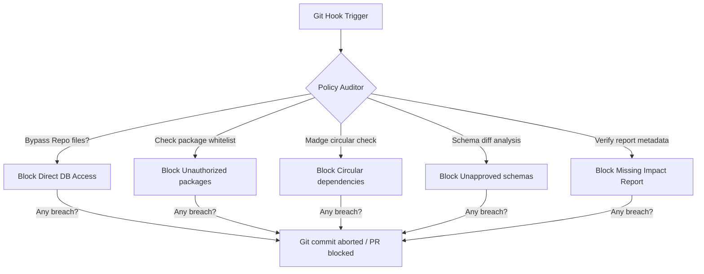

# Policy Enforcement Model — Stayflexi Platform

This document describes the validation checkers, git hooks, and compiler blocks used to enforce software policies across database access, packages installation, schema changes, and dependency paths.

---

## 1. Compliance Engine Rules

The compliance engine interceptor executes checks on every Git commit and PR creation.

---

## 2. Policy Enforcement Specifications

### 1. Direct Database Access

- **Policy Constraint**: Code outside repository directories (e.g. controllers, services, layout pages) is forbidden from importing the Prisma Client directly or executing SQL strings.
- **AST Enforcement Rule**: If file path does not match `**/repositories/**` and file imports `@prisma/client`, throw compilation error.
- **Reference**: [DATABASE_REGISTRY.md](file:///C:/Stayflexi/docs/discovery/DATABASE_REGISTRY.md).

### 2. Unauthorized Package Installs

- **Policy Constraint**: Adding libraries to `package.json` that are not listed in [PACKAGE_GOVERNANCE_MODEL.md](file:///C:/Stayflexi/docs/discovery/PACKAGE_GOVERNANCE_MODEL.md) is blocked.
- **Git Enforcement Rule**: Pre-commit script diffs `package.json`. If new dependencies are added without approval tokens, abort commit.

### 3. Circular Dependencies

- **Policy Constraint**: Circular execution imports are completely banned.
- **Engine Verification**: Execute `npx madge --circular ./src` during PR tests. If circles exist, fail PR gate.

### 4. Unapproved Schema Changes

- **Policy Constraint**: Modifying `*.prisma` database schemas or pothos GraphQL types without approval signatures is blocked.
- **Gate Enforcement**: PR builds diff schema files against baseline branches. If diff exists and `GateStatus != APPROVED`, block build.

### 5. Missing Impact Analysis

- **Policy Constraint**: Code merges require a completed Change Impact Report.
- **Enforcement Rule**: Gate verification checks for the presence of the report markdown file in [C:/Stayflexi/docs/discovery/](file:///C:/Stayflexi/docs/discovery/). If missing, block PR.
