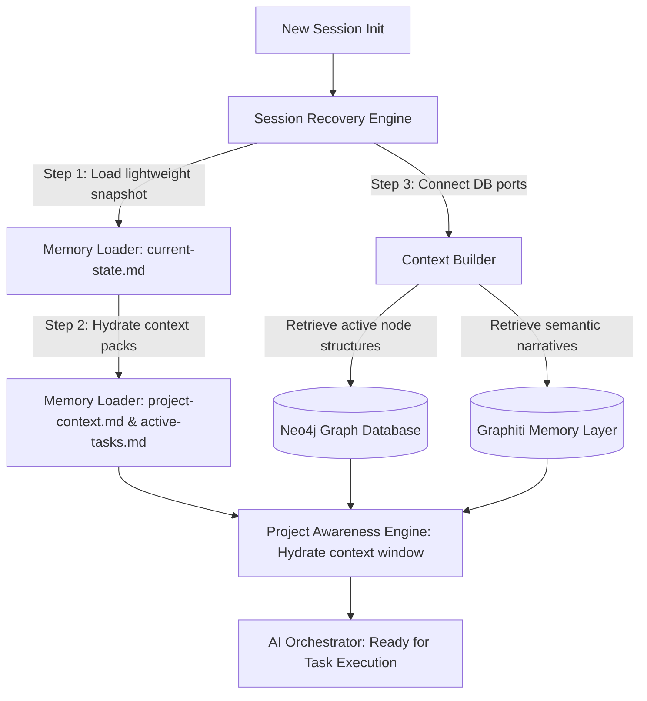

# Project Awareness & Session Recovery Architecture — Stayflexi Platform

This document describes the design of the Project Awareness Engine, Context Builder, Session Recovery Engine, and Memory Loader components used to boot and recover orchestrator understanding across sessions.

---

## 1. High-Level Engine Architecture

The Session Recovery Layer enables the AI to restore complete project context after computer shutdowns, editor restarts, or session updates without re-explaining the codebase.

---

## 2. Component Specifications

### Session Recovery Engine

- **Purpose**: Main coordinator for bootstrapping and recovery phases.
- **Workflow**: Intercepts chat initiation triggers, checks for the presence of local recovery states, initializes database connections to PostgreSQL/Neo4j, and triggers the Memory Loader.

### Memory Loader

- **Purpose**: Efficiently hydrates the LLM context window using structured context.
- **Workflow**: Sequentially reads files defined in [STARTUP_MEMORY_PACK.md](file:///C:/Stayflexi/docs/discovery/STARTUP_MEMORY_PACK.md), prioritizing the lightweight `current-state.md` snapshot.

### Context Builder

- **Purpose**: Dynamically query databases to extract targeted runtime facts.
- **Workflow**: Performs sub-graph queries inside Neo4j and vector queries in Graphiti to pull only the elements relevant to the active user query, filtering out redundant documentation.

### Project Awareness Engine

- **Purpose**: Holds the active operational state of the workspaces.
- **Workflow**: Holds and references variables detailing project versions, release status, open risks, and current goals.
