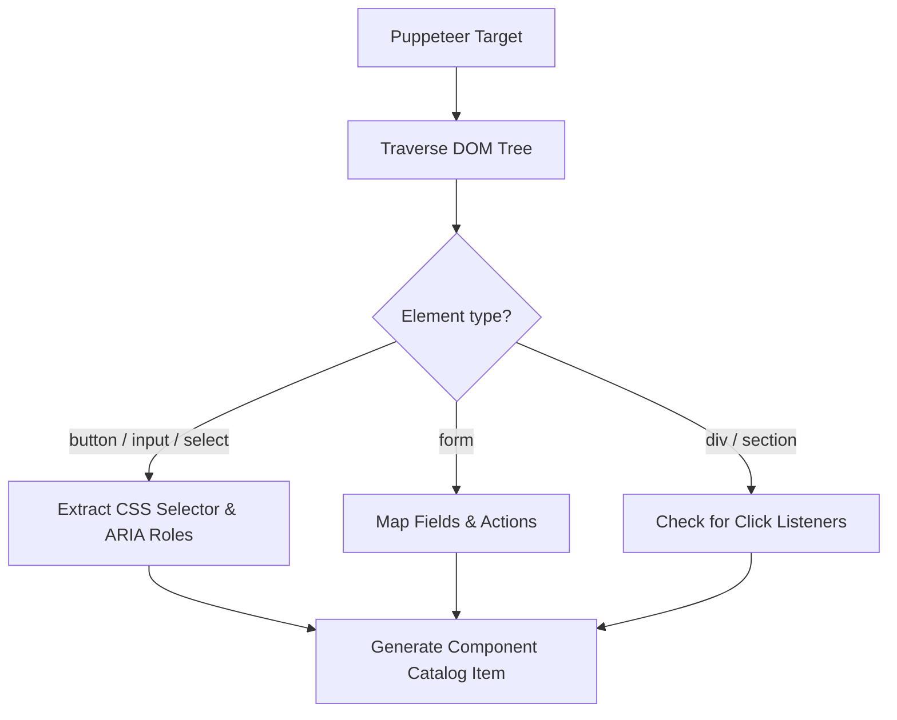

# Puppeteer Runtime Inspection Strategy — Stayflexi Platform

This document describes the runtime inspection, interactive DOM discovery, and visual capture procedures executed by Puppeteer.

---

## 1. Remote Browser Connection & CDP Integration

Rather than launching a separate instance, Puppeteer attaches directly to the Chromium browser context spawned by Playwright or running in the local application cluster.

### Connection Handshake

```typescript
import puppeteer from 'puppeteer-core'
import axios from 'axios'

async function connectToActiveBrowser() {
  // Query Chromium CDP metadata to find the WebSocket URL
  const response = await axios.get('http://localhost:9223/json/version')
  const wsDebuggerUrl = response.data.webSocketDebuggerUrl

  // Attach Puppeteer
  const browser = await puppeteer.connect({
    browserWSEndpoint: wsDebuggerUrl,
    defaultViewport: null,
  })

  return browser
}
```

---

## 2. Interactive DOM Discovery

Puppeteer traverses the document object model (DOM) to map out interactive components, anchors, and inputs to feed into the [UIComponent](file:///C:/Stayflexi/docs/discovery/NODE_CATALOG.md#L73) catalog.



### Extracted Element Metadata

For every active control found on the page, the parser extracts:

- `cssSelector`: Unique locator path.
- `role`: ARIA accessibility designation.
- `bindingEvent`: Registered runtime listeners (e.g. `onClick`, `onChange`).
- `associatedEndpoint`: Checked via intercepted fetch/XHR endpoints during interaction.

---

## 3. Runtime State & LocalStorage Inspection

We evaluate browser memory, window-level global parameters, and storage objects to identify synchronization discrepancies.

- **Local Storage Auditing**:
  ```typescript
  const jwt = await page.evaluate(() => localStorage.getItem('sf_jwt_token'))
  const currentOrg = await page.evaluate(() => localStorage.getItem('sf_current_org_id'))
  ```
- **React/Next State Extraction**: Parse virtual DOM properties attached to DOM nodes (e.g., `__reactFiber$...`) to extract reactive hook values, listing details, and transient client states.

---

## 4. Screenshot Collection & Visual Regression Analysis

Visual verification ensures that CSS shifts or components layout breakdowns do not occur during UI changes.

1. **Target Viewports**: Run captures at standard breakpoints (Desktop `1440x900`, Tablet `768x1024`, Mobile `375x667`).
2. **Snapshot Saving**: Save binary files to standard path variables:
   - Location: `C:/Users/Sathish/.gemini/antigravity-cli/brain/264b6ede-4cd3-4cad-a80f-6d7eddbb7afd/`
3. **Layout Comparison**: Run pixel-by-pixel comparisons using `pixelmatch` or similar canvas diff libraries to flag alignment regressions.
