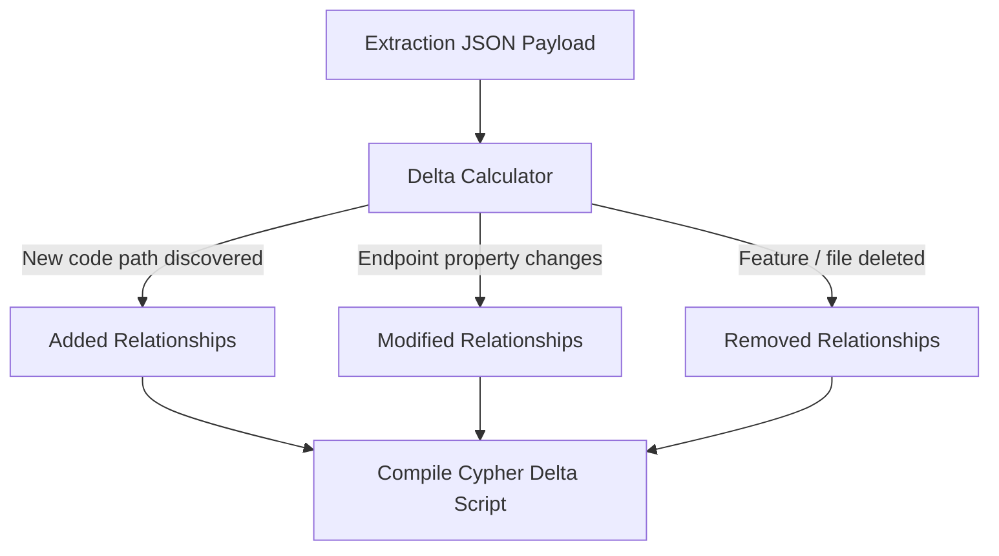

# Relationship Delta Model — Stayflexi Platform

This document describes the relationship delta calculations, Cypher transaction templates, and validation logic used to apply graph structural modifications.

---

## 1. Delta Generation Logic

The Delta Generation Engine processes the change extraction JSON payload to identify how relationships inside Neo4j must adapt.



---

## 2. Cypher Transaction Templates

### 1. Added Relationships

- **Scenario**: A new endpoint `/api/v1/bookings/status` is created and mapped to the booking feature `FEAT-BOOK-CREATE`.
- **Cypher Ingestion**:
  ```cypher
  MATCH (f:Feature {featureId: $featureId})
  MATCH (e:Endpoint {route: $endpointRoute, method: $method})
  MERGE (f)-[r:EXPOSES]->(e)
  ON CREATE SET r.createdAt = datetime();
  ```

### 2. Modified Relationships

- **Scenario**: Updating rate limits or authentication credentials metadata on a connection path.
- **Cypher Ingestion**:
  ```cypher
  MATCH (ui:UIComponent {name: $componentName})-[r:CALLS]->(e:Endpoint {route: $endpointRoute})
  SET
    r.updatedAt = datetime(),
    r.isAuthRequired = $isAuthRequired;
  ```

### 3. Removed (Severed) Relationships

- **Scenario**: Removing access paths when an endpoint is deprecated or code imports are deleted.
- **Cypher Ingestion**:
  ```cypher
  MATCH (f:Feature {featureId: $featureId})-[r:EXPOSES]->(e:Endpoint {route: $endpointRoute})
  DELETE r;
  ```

---

## 3. Post-Delta Validation

To prevent orphans nodes or disconnected subgraphs:

- **Clean-up Rule**: If an `Endpoint` node has zero incoming `EXPOSES` or `CALLS` relations, flag the endpoint as orphaned.
- **Integrity Rule**: Confirm that every `UserJourney` remains linked to at least one active E2E test.
