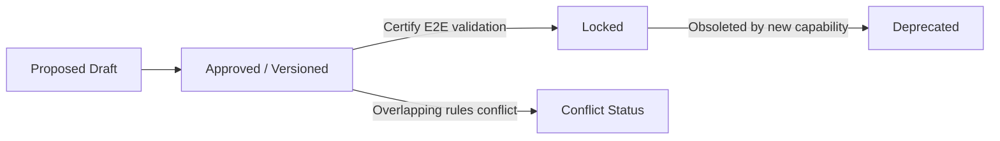

# Requirement Governance Model — Stayflexi Platform

This document describes the compliance standards, locking rules, deprecation stages, and conflict-resolution processes for requirements and capability specifications.

---

## 1. Requirement Life Cycle & Versioning

To ensure product specifications always match the running code, all [Requirement](file:///C:/Stayflexi/docs/discovery/NODE_CATALOG.md#L9) nodes undergo structured lifecycle transitions.

### 1. Requirement Creation Rules

Every requirement registered in the project docs must contain:

- Unique `id` (e.g., `REQ-BOOK-001`).
- `title` and `description` defining business logic boundaries.
- **Prerequisite Links**: Must be linked to a [BusinessCapability](file:///C:/Stayflexi/docs/discovery/NODE_CATALOG.md#L19) node.

### 2. Versioning

When a requirement is updated:

1. Retain the parent `Requirement` node.
2. Create a new `RequirementVersion` node containing `versionId: String` (e.g., `v1.2`), `author: String`, `changeLog: String`, and `updatedAt: DateTime`.
3. Establish relationship `(r:Requirement)-[:HAS_VERSION]->(rv:RequirementVersion)`.

---

## 2. Locking, Deprecation, & Conflict Resolution

### Requirement Locking

- **Trigger**: When E2E verification tests certify a requirement (e.g., Guest Check-out billing calculations), set property `isLocked = true`.
- **Policy**: Any proposed code changes that attempt to bypass or alter locked business rules are immediately blocked by the compiler gate. To modify, an engineer must first create a version request and obtain architect signature overrides.

### Requirement Deprecation

- **Trigger**: An existing requirement is obsoleted by a new system feature.
- **Policy**: Change `status` to `DEPRECATED`. The impact engine traverses the graph:
  `MATCH (r:Requirement {status: "DEPRECATED"})-[:IMPLEMENTED_BY]->(f:Feature)`
  Flag all downstream features for refactoring. Maintain legacy mappings until the replacement feature compiles successfully.

### Requirement Conflict Resolution

- **Definition**: Two requirements claim opposing constraints (e.g., `REQ-A` locks manual discounts while `REQ-B` requests custom manager rebates).
- **Resolution Pipeline**:
  1. **Identify**: Compare AST definitions and vector representations of requirements text.
  2. **Flag**: Create a `Conflict` node in the graph: `(reqA)-[:CONFLICTS_WITH]->(reqB)`.
  3. **Halt**: Stop any code generation pipelines referencing these nodes.
  4. **Escalate**: Trigger human architect review to resolve the rule priority hierarchy.
