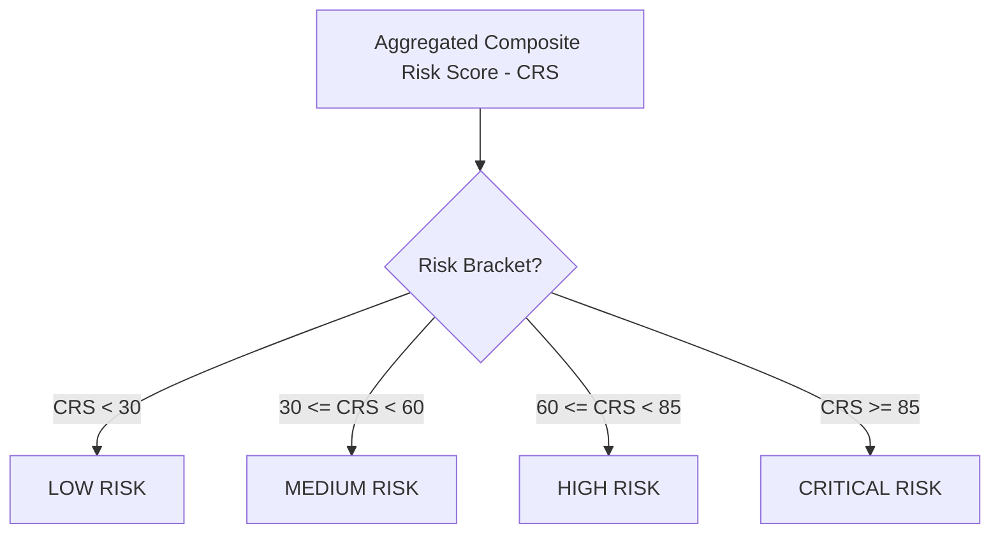

# Risk Scoring Engine — Stayflexi Platform

This document describes the scoring logic, classification thresholds, weight distributions, and verification criteria used by the orchestrator to grade software risk levels.

---

## 1. Multi-Vector Risk Aggregation

The engine compiles a Composite Risk Score (CRS) ranging from `10.0` to `100.0` based on five core evaluation vectors.

$$\text{CRS} = \left( (TR \times 0.25) + (BR \times 0.25) + (SR \times 0.20) + (PR \times 0.15) + (CR \times 0.15) \right) \times 10.0$$

### Evaluation Vectors Weight Table

| Risk Vector               | Weight | Primary Indicators                                   | References                                                                                  |
| :------------------------ | :----- | :--------------------------------------------------- | :------------------------------------------------------------------------------------------ |
| **Technical Risk (TR)**   | 25%    | Direct and indirect code dependencies.               | [TECHNICAL_RISK_MODEL.md](file:///C:/Stayflexi/docs/discovery/TECHNICAL_RISK_MODEL.md).     |
| **Business Risk (BR)**    | 25%    | User journeys, transactional pages, and reports.     | [BUSINESS_RISK_MODEL.md](file:///C:/Stayflexi/docs/discovery/BUSINESS_RISK_MODEL.md).       |
| **Security Risk (SR)**    | 20%    | JWT tokens, authentication routes, tenant isolation. | [SECURITY_RISK_MODEL.md](file:///C:/Stayflexi/docs/discovery/SECURITY_RISK_MODEL.md).       |
| **Performance Risk (PR)** | 15%    | DB queries indexes, event loop lag, memory leaks.    | [PERFORMANCE_RISK_MODEL.md](file:///C:/Stayflexi/docs/discovery/PERFORMANCE_RISK_MODEL.md). |
| **Cost Risk (CR)**        | 15%    | Pod overheads, LLM tokens, S3 bucket storage.        | [COST_IMPACT_MODEL.md](file:///C:/Stayflexi/docs/discovery/COST_IMPACT_MODEL.md).           |

---

## 2. Risk Classification Brackets

The aggregated CRS determines the change classification bracket:

### 1. LOW (`CRS < 30`)

- **Scope**: Documentation updates, helper utility edits, stylesheet formatting, adding optional API parameters.
- **Dependency Scope**: 0 user journeys degraded, 0 schema breakages predicted.
- **Orchestration Gate**: Auto-merge allowed on compile success.

### 2. MEDIUM (`30 <= CRS < 60`)

- **Scope**: Code updates to microservice controllers, adding new nullable columns, or exposing secondary GraphQL fields.
- **Dependency Scope**: No direct impact on payment ledgers, minor performance overheads predicted (< 100ms lag).
- **Orchestration Gate**: Require architect code warnings, execute standard tests.

### 3. HIGH (`60 <= CRS < 85`)

- **Scope**: Modifying RBAC authorization rules, database alterations on core booking tables, or changing GraphQL federated mutations.
- **Dependency Scope**: Inter-service gateway routing touched, potential timeline loading performance degradation.
- **Orchestration Gate**: Require human review sign-offs, compile full integration test suites.

### 4. CRITICAL (`CRS >= 85`)

- **Scope**: Dropping tables or columns, bypassing `organizationId` tenant filters, modifying check-out transaction sagas, or editing Stripe webhook signatures.
- **Dependency Scope**: Imminent payment processing failures, database migrations downtime, or cross-tenant data leaks.
- **Orchestration Gate**: Complete pipeline block. Require dual-signature override and dry-run shadow deployments.
