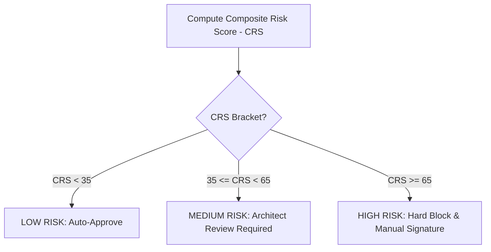

# Risk Scoring Model — Stayflexi Platform

This document describes the mathematical formulas, threshold brackets, and mitigation gates used to compute risks before changes are executed on the codebase.

---

## 1. Risk Category Formulations

We calculate risk across five distinct operational dimensions. Each category is scored on a scale of `1.0` to `10.0`.

### Technical Risk (TR)

- **Focus**: Impact on code modules, direct dependencies, and compile complexities.
- **Formula**:
  $$TR = \min\left(10.0, \, (N_{\text{Direct}} \times 1.5) + (N_{\text{Indirect}} \times 0.5)\right)$$
- **Variables**:
  - $N_{\text{Direct}}$: Count of immediate target file imports.
  - $N_{\text{Indirect}}$: Count of transitive class references.

### Business Risk (BR)

- **Focus**: Exposure of core transactional user journeys, integrations, and reports.
- **Formula**:
  $$BR = \min\left(10.0, \, (N_{\text{Journeys}} \times 2.0) + (N_{\text{External}} \times 1.5)\right)$$
- **Variables**:
  - $N_{\text{Journeys}}$: Discovered [UserJourney](file:///C:/Stayflexi/docs/discovery/NODE_CATALOG.md#L121) nodes touched.
  - $N_{\text{External}}$: Affected [ExternalSystem](file:///C:/Stayflexi/docs/discovery/NODE_CATALOG.md#L116) nodes (e.g. Stripe, Booking.com).

### Security Risk (SR)

- **Focus**: Exposure of authorization checks or multi-tenant database isolation.
- **Formula**:
  $$
  SR = \begin{cases}
  10.0 & \text{if } \text{TouchesAuth} \lor \text{AltersTenantIsolation} \\
  1.0 & \text{otherwise}
  \end{cases}
  $$
- **Triggers**: Modifying `organizationId` database filters, JWT validation wrappers, or routes marked `isAuthRequired: true`.

### Performance Risk (PR)

- **Focus**: Latency, CPU loading on timeline views, and DB lookup operations.
- **Formula**:
  $$PR = \min\left(10.0, \, (N_{\text{TableModifications}} \times 3.0) + (N_{\text{NewResolvers}} \times 2.0)\right)$$
- **Variables**:
  - $N_{\text{TableModifications}}$: Schema changes to high-frequency tables.
  - $N_{\text{NewResolvers}}$: Additional federated resolver hooks.

### Data Risk (DR)

- **Focus**: Schema migration database lockouts, column drops, or data loss potential.
- **Formula**:
  $$
  DR = \begin{cases}
  10.0 & \text{if Column Drop} \\
  7.0 & \text{if Column Type Alteration} \\
  3.0 & \text{if New Nullable Column} \\
  1.0 & \text{otherwise}
  \end{cases}
  $$

---

## 2. Composite Risk Score (CRS) Calculation

Once individual category scores are fetched, the engine compiles a composite score:

$$\text{CRS} = \left( (TR \times 0.25) + (BR \times 0.25) + (SR \times 0.20) + (PR \times 0.15) + (DR \times 0.15) \right) \times 10.0$$

This yields a score between `10.0` and `100.0`.

---

## 3. Threshold Decision Gate Rules

### Risk Level Actions

1. **LOW RISK (CRS < 35)**:
   - Safe to apply changes automatically.
   - Run basic unit tests.
2. **MEDIUM RISK (35 <= CRS < 65)**:
   - Suspend auto-execution. Produce a detailed impact report.
   - Request review authorization. Run the full E2E validation test suite.
3. **HIGH RISK (CRS >= 65)**:
   - Hard lock commit pipelines.
   - Require dual approval signatures. Execute full dry-run migrations and shadow-traffic testing.
