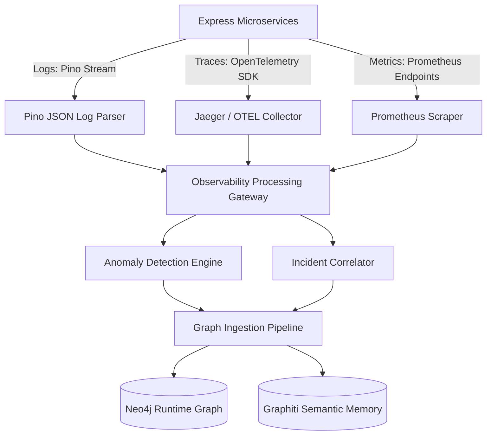

# Runtime Intelligence & Observability Architecture — Stayflexi Platform

This document describes the design of the Runtime Intelligence, Observability, Monitoring, and Incident processing layers, establishing real-time feedback loops between production and the Knowledge Graph.

---

## 1. High-Level Telemetry & Auditing Pipeline

The orchestrator utilizes standard OpenTelemetry hooks, Prometheus scrapes, and JSON log parsers to collect performance and runtime profiles across microservices.

---

## 2. Layer Definitions

### Runtime Intelligence Layer

- **Purpose**: Translates raw machine data into structured domain-specific models.
- **Workflow**: Intercepts request headers, database transaction metrics, and client-side web vitals to update execution weights on the graph. (e.g. tracking that `GET /api/v1/bookings` represents 65% of API volume).

### Observability Layer

- **Purpose**: Telemetry instrumentation, collection, and storage.
- **Implementation**:
  - **Metrics**: Standard Prometheus middleware attached to Express services in `services/`.
  - **Traces**: OpenTelemetry SDK injecting W3C TraceContext headers on request boundaries to trace distributed sagas.
  - **Logs**: Structured Pino logger streaming payload signatures to standard output.

### Monitoring Layer

- **Purpose**: Evaluates thresholds and triggers alerting events.
- **Workflow**: Polls metrics endpoints (e.g. `/metrics`) and executes alerting rules when metrics breach baseline levels (e.g., error rate > 5.0% for 3 minutes).

### Incident Intelligence Layer

- **Purpose**: Aggregates related alerts into incidents, executes root cause analysis (RCA), and updates the memory layers.
- **Workflow**: Matches alerts to shared database tables or microservices using Cypher traversal paths and identifies potential code commit causes.
