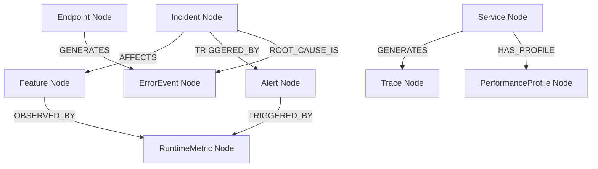

# Neo4j Runtime Graph Integration Model — Stayflexi Platform

This document describes the property definitions, relationship schemas, and Cypher statement scripts used to append observability telemetry to static system nodes.

---

## 1. Node Schema Definitions

We introduce six runtime nodes to capture the physical state of the microservices:

### `RuntimeMetric`

- **Properties**: `id: String`, `name: String` (e.g. `http_requests_total`), `value: Float`, `timestamp: DateTime`.

### `ErrorEvent`

- **Properties**: `id: String`, `errorClass: String`, `message: String`, `stackTrace: String`, `timestamp: DateTime`.

### `Alert`

- **Properties**: `id: String`, `name: String`, `severity: String`, `metricName: String`, `timestamp: DateTime`.

### `Trace`

- **Properties**: `id: String`, `traceId: String`, `spanId: String`, `parentSpanId: String`, `durationMs: Integer`, `timestamp: DateTime`.

### `Incident`

- **Properties**: `id: String`, `summary: String`, `severity: String`, `status: String`, `createdAt: DateTime`, `resolvedAt: DateTime`.

### `PerformanceProfile`

- **Properties**: `id: String`, `cpuUsagePercent: Float`, `memoryUsageBytes: Float`, `timestamp: DateTime`.

---

## 2. Graph Mappings & Relationships



| Source Node | Relationship Type | Target Node     | Description                                                                     |
| :---------- | :---------------- | :-------------- | :------------------------------------------------------------------------------ |
| `Feature`   | `OBSERVED_BY`     | `RuntimeMetric` | Binds business capabilities to operational performance counters.                |
| `Endpoint`  | `GENERATES`       | `ErrorEvent`    | Maps API call failures and uncaught payload errors to routes.                   |
| `Service`   | `GENERATES`       | `Trace`         | Associates distributed network spans with their hosting microservice container. |
| `Incident`  | `AFFECTS`         | `Feature`       | Links P0-P3 outages to specific user capabilities.                              |
| `Alert`     | `TRIGGERED_BY`    | `RuntimeMetric` | Connects threshold breaches to the offending metric value.                      |
| `Incident`  | `ROOT_CAUSE_IS`   | `ErrorEvent`    | Traces incident origins to raw runtime exception entries.                       |

---

## 3. Cypher Integration Queries

The monitoring adapter feeds telemetry into the graph using these optimized queries:

### Logging Endpoint Errors

```cypher
MATCH (e:Endpoint {route: $endpointRoute, method: $method})
CREATE (err:ErrorEvent {
  id: apoc.create.uuid(),
  errorClass: $errorClass,
  message: $message,
  stackTrace: $stackTrace,
  timestamp: datetime()
})
CREATE (e)-[:GENERATES]->(err);
```

### Mapping Metrics to Features

```cypher
MATCH (f:Feature {featureId: $featureId})
CREATE (m:RuntimeMetric {
  id: apoc.create.uuid(),
  name: $metricName,
  value: $value,
  timestamp: datetime()
})
CREATE (f)-[:OBSERVED_BY]->(m);
```

### Logging Service Spans (Traces)

```cypher
MATCH (s:Service {name: $serviceName})
CREATE (t:Trace {
  id: apoc.create.uuid(),
  traceId: $traceId,
  spanId: $spanId,
  parentSpanId: $parentSpanId,
  durationMs: $durationMs,
  timestamp: datetime()
})
CREATE (s)-[:GENERATES]->(t);
```

### Ingesting Production Incidents

```cypher
MATCH (f:Feature {featureId: $featureId})
CREATE (i:Incident {
  id: $incidentId,
  summary: $summary,
  severity: $severity,
  status: "ACTIVE",
  createdAt: datetime()
})
CREATE (i)-[:AFFECTS]->(f);
```
