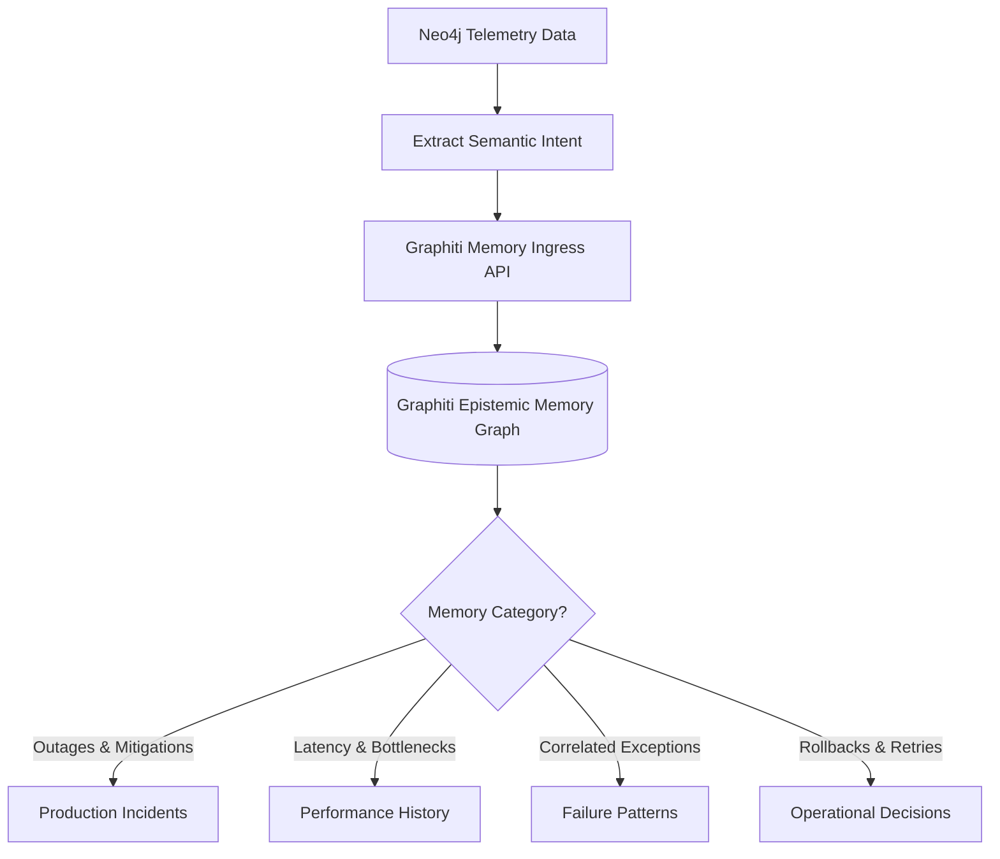

# Runtime Graphiti Memory Integration Model — Stayflexi Platform

This document describes the semantic memory ingestion schemas and long-term memory patterns used to store operational history, incident details, performance trends, and resolution actions in Graphiti.

---

## 1. Graphiti Memory Ingestion Architecture

While Neo4j records immediate runtime relationships, the Graphiti Memory Layer extracts semantic knowledge, grouping incidents and trends into long-term memories.

---

## 2. Memory Category Specifications

### Production Incidents Memory

- **Goal**: Accumulate incident logs to allow the orchestrator to check past solutions when new failures arise.
- **Example Memory Text**:
  > _"Incident INC-20260620-001 occurred on 2026-06-20T19:15:56Z. The root cause was database write contention on the bookings table. Mitigated by applying index updates to room ids and configuration variables."_

### Performance History Memory

- **Goal**: Cache performance statistics to warn against code implementations that degrade user response times.
- **Example Memory Text**:
  > _"The Next.js route `/bookings` displays p95 latency degradation (4.2 seconds) when timeline checks contain more than 300 active grid allocations. Event-loop lag on booking-service is correlated."_

### Failure Patterns Memory

- **Goal**: Identify and store recurring exceptions.
- **Example Memory Text**:
  > _"OTA sync tasks periodically trigger Stripe webhook timeouts during high-load intervals, indicating concurrent transaction contention."_

### Operational Decisions Memory

- **Goal**: Log architectural adaptations, config adjustments, and hotfixes.
- **Example Memory Text**:
  > _"Operational Decision: Enabled automatic retries with exponential backoffs on OTA API integration routes to handle rate-limit lockouts."_

---

## 3. Graphiti Memory Ingestion Pipeline

The orchestrator updates memory using the following steps:

1. **Incident Resolution Listener**: On incident closure, convert log traces and resolution checklists into semantic markdown summaries.
2. **Entity Extraction**: Graphiti parses the summary to extract entities (e.g. `PrismaBookingRepository`, `StripeWebhooks`) and link them to operational events.
3. **Retrieval**: During future change evaluations, the orchestrator queries Graphiti memory:
   `await memory.search("Prisma Booking timeouts")`
   This retrieves historical incident details to inform risk scores.
