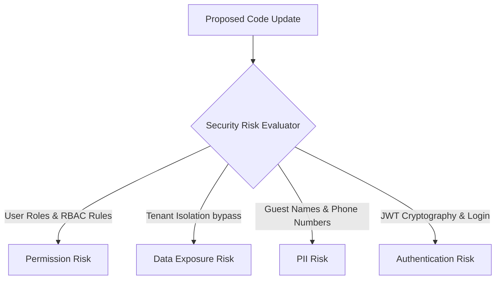

# Security Risk Model — Stayflexi Platform

This document describes the security risk parameters, auditing policies, and trigger conditions targeting Permission, Data Exposure, PII, and Authentication controls.

---

## 1. Security Risk Domains

We evaluate four domains of security risk to ensure code modifications do not introduce access vulnerabilities or leak confidential guest database information.

---

## 2. Evaluation Criteria & Auditing Gates

### 1. Permission Risk

- **Focus**: User roles, REST endpoints access rules, and RBAC middleware.
- **Evaluation Criteria**:
  - **HIGH RISK (Score: 9.0-10.0)**: Bypassing authorization filters on admin routes, or changing controller roles from `Admin` to `Staff` on financial endpoints.
  - **LOW RISK (Score: 1.0-2.0)**: Adding minor UX component visibility restrictions.

### 2. Data Exposure Risk

- **Focus**: Multi-tenant database filters: `organizationId` foreign key checks.
- **Evaluation Criteria**:
  - **CRITICAL RISK (Score: 10.0)**: Modifying Prisma queries or table structures to select database records without filtering by `organizationId`. A defect here leaks data across hotel organizations.
  - **LOW RISK (Score: 1.0-3.0)**: Interacting with global system config tables.
- **Reference**: [SECURITY_INVENTORY.md](file:///C:/Stayflexi/docs/discovery/SECURITY_INVENTORY.md).

### 3. PII (Personally Identifiable Information) Risk

- **Focus**: Guest billing databases, checkout names, and logger outputs.
- **Evaluation Criteria**:
  - **HIGH RISK (Score: 8.0-10.0)**: Returning raw guest phone numbers, emails, or passport credentials in unauthenticated REST/GraphQL payloads, or streaming them to Pino logs.
  - **LOW RISK (Score: 1.0-3.0)**: Storing hashed IDs or aggregate telemetry.

### 4. Authentication Risk

- **Focus**: Token generation, passport layers, and session lifecycle hooks.
- **Evaluation Criteria**:
  - **HIGH RISK (Score: 9.0-10.0)**: Modifying JWT expiry configuration, altering crypto keys generation logic, or changing auth middlewares.
  - **Reference**: [testLogoutLogin.test.ts](file:///C:/Stayflexi/src/tests/integration/testLogoutLogin.test.ts).
