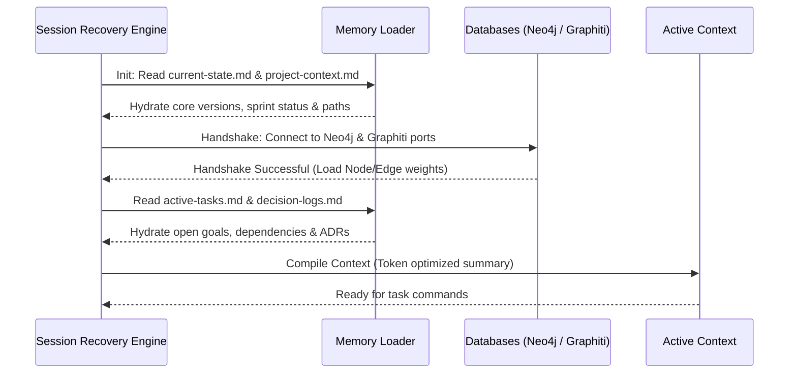

# Session Recovery Process — Stayflexi Platform

This document describes the step-by-step boot, database connection, memory pack parsing, and context construction procedures executed at the start of a session.

---

## 1. Startup Sequence

When the editor or AI orchestrator starts up, the Session Recovery Engine executes an automated hydration sequence:

---

## 2. Recovery Pipeline Steps

### Step 1: Initialize New Session

- **Trigger**: New chat session initialized or computer booted.
- **Action**: Check for the presence of local recovery files in [C:/Stayflexi/docs/discovery/](file:///C:/Stayflexi/docs/discovery/).

### Step 2: Load Memory Pack

- **Action**: Read the single-file snapshot [current-state.md](file:///C:/Stayflexi/docs/discovery/current-state.md) to instantly learn the current sprint, active task, and recent completed task.
- **Action**: Read [project-context.md](file:///C:/Stayflexi/docs/discovery/project-context.md) to load monorepo service boundaries.

### Step 3: Establish Database Connections

- **Action**: Connect to Neo4j database on port `7687` and query metadata stats (node/relationship counts).
- **Action**: Connect to Graphiti memory database and retrieve active failure patterns.

### Step 4: Hydrate GraphQL Schema

- **Action**: Run health check probes against Apollo federated gateway to verify schema composability.

### Step 5: Hydrate Active Tasks & Decisions

- **Action**: Read [active-tasks.md](file:///C:/Stayflexi/docs/discovery/active-tasks.md) and [decision-log.md](file:///C:/Stayflexi/docs/discovery/decision-log.md) to parse previous architectural overrides.

### Step 6: Build Context & Resume Work

- **Action**: Compile these inputs into the prompt context. Notify the user:
  > _"Session recovered successfully. Workspace Stayflexi v5.2 loaded. Active task: 'Add corporate customerType'. Database & Memory connected. Ready."_
