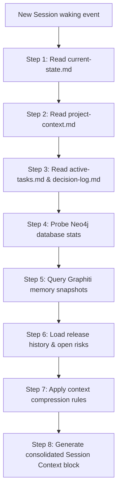

# Session Start Workflow Specification — Stayflexi Platform

This document describes the workflow sequence, file loading hierarchy, and context compilation instructions executed immediately upon initializing a new chat or developer session.

---

## 1. Session Start Ingestion Sequence

To establish project awareness within minutes of booting a new session, the Memory Loader executes the following ingestion sequence:



---

## 2. Ingestion Step Specifications

### Step 1: Read `current-state.md`

- **Goal**: Establish the immediate task focus and baseline snapshot.
- **Reference**: [current-state.md](file:///C:/Stayflexi/docs/discovery/current-state.md).

### Step 2: Read `project-context.md`

- **Goal**: Reconstruct service boundaries and folder configurations.
- **Reference**: [project-context.md](file:///C:/Stayflexi/docs/discovery/project-context.md).

### Step 3: Read Sprints & Design Records

- **Goal**: Parse active task dependencies and Architectural Decision Records.
- **Reference**: [active-tasks.md](file:///C:/Stayflexi/docs/discovery/active-tasks.md), [decision-log.md](file:///C:/Stayflexi/docs/discovery/decision-log.md).

### Step 4: Hydrate Knowledge Graph & Semantic Memory

- **Goal**: Query Neo4j to confirm catalog structure matches codebase. Query Graphiti to load resolved failure patterns.

### Step 5: Load Release & Alert Metrics

- **Goal**: Load current release version and alert indicators.

### Step 6: Execute Compression & Compile Context

- **Goal**: Apply vector pruning to reduce context sizing down to target features dependencies.
- **Reference**: [CONTEXT_COMPRESSION_MODEL.md](file:///C:/Stayflexi/docs/discovery/CONTEXT_COMPRESSION_MODEL.md).

---

## 3. Session Context Template

The workflow compiles the session context block using the following format:

```text
================================================================================
SESSION CONTEXT HYDRATED
================================================================================
Project: Stayflexi Platform v5.2.0 (RELEASE-Q2)
Active Sprint Goal: Add corporate customerType parameter to checkout invoice.
Active Task: TSK-00129 (In Progress)
Dependencies: booking-service, timeline page layout, bookings table columns.
Open Risks: 0 active anomalies.
Database: Connected (Neo4j: 284 nodes, Graphiti: 142 memories).
Ready for commands.
================================================================================
```

This context block is appended to the initial system prompt to establish immediate project awareness.
