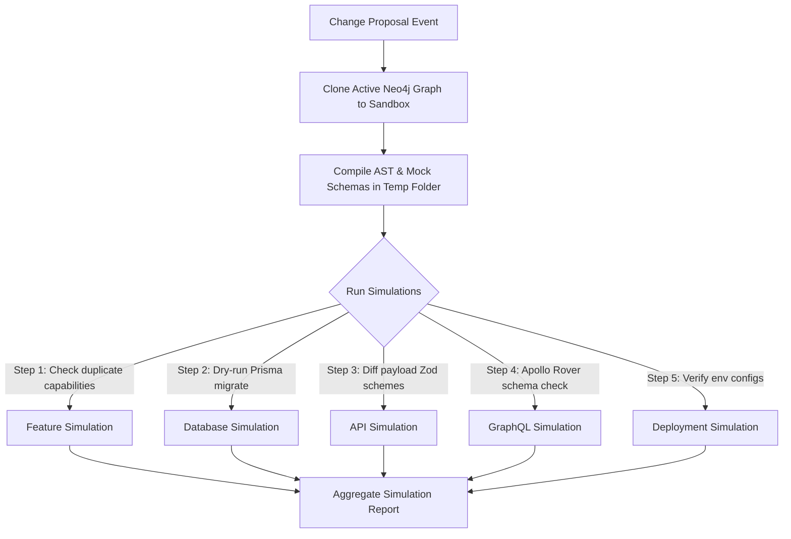

# Simulation Engine Model — Stayflexi Platform

This document describes the design, execution workflows, sandbox configurations, and verification steps used to dry-run codebase modifications.

---

## 1. Sandbox Simulation Architecture

To prevent breaking active environments, the orchestrator constructs a transient, isolated virtual workspace and graph clone.

---

## 2. Simulation Execution Workflows

### 1. Feature Changes Simulation

- **Workflow**: Parse proposal descriptions and query [DUPLICATE_INTELLIGENCE_MODEL.md](file:///C:/Stayflexi/docs/discovery/DUPLICATE_INTELLIGENCE_MODEL.md). Clone Feature nodes to test if proposed relationships overlap with active capabilities.

### 2. Database Changes Simulation

- **Workflow**: Copy Prisma schemas from the workspace folder [schema/](file:///C:/Stayflexi/src/database/prisma/schema/) to a temporary workspace location.
- **Verification Command**:
  `npx prisma migrate diff --from-schema-datasource=./original.prisma --to-schema-datamodel=./simulated.prisma --script`
  This outputs target SQL updates without applying them.

### 3. API Changes Simulation

- **Workflow**: Trace routes in Express route scripts. Evaluate Zod validations against mock payloads.
- **Verification Rule**: Verify that all parameters required by the new validator schema match the fields supplied by UI forms in Next.js app layouts.

### 4. GraphQL Changes Simulation

- **Workflow**: Run code-first Pothos builds in the sandbox and export schema definitions.
- **Verification Command**:
  `npx rover subgraph check gateway-composition --schema ./sandbox-schema.graphql`
  Diffs subgraphs to identify broken resolvers or missing query properties.

### 5. Deployment Changes Simulation

- **Workflow**: Audit environment dependencies and Kubernetes pod limits.
- **Verification Rule**: Crosscheck newly added env keys against current secrets mappings in the deployment metadata catalog.
