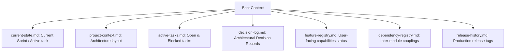

# Startup Memory Pack Specification — Stayflexi Platform

This document describes the purpose, owner roles, and synchronization update rules for the metadata context files used during session recovery.

---

## 1. Startup Memory Pack Schema

To avoid parsing the entire code repository during initialization, the orchestrator reads a set of metadata files.

---

## 2. Context Files Specification Matrix

### 1. `current-state.md` (Single-File Project Snapshot)

- **Purpose**: Minimal startup summary defining what is happening _right now_. Prevents reading other catalogs if the user queries active tasks.
- **Owner**: AI Orchestrator Runner.
- **Update Rules**: Automatically overwritten at the start and end of every task execution.
- **Reference**: [current-state.md](file:///C:/Stayflexi/docs/discovery/current-state.md).

### 2. `project-context.md`

- **Purpose**: High-level structural summary of Stayflexi services directories, monorepo packages, and database layers.
- **Owner**: Lead Enterprise Architect.
- **Update Rules**: Updated when a new service is added or refactored.
- **Reference**: [project-context.md](file:///C:/Stayflexi/docs/discovery/project-context.md).

### 3. `active-tasks.md`

- **Purpose**: Lists sprint task history (open, blocked, completed status).
- **Owner**: Product Owner / AI Planner.
- **Update Rules**: Synchronized after every code merge event.
- **Reference**: [active-tasks.md](file:///C:/Stayflexi/docs/discovery/active-tasks.md).

### 4. `decision-log.md`

- **Purpose**: Index of Architectural Decision Records (ADRs) and design rationales.
- **Owner**: Architecture Review Board.
- **Update Rules**: Appended when a design decision is approved.
- **Reference**: [decision-log.md](file:///C:/Stayflexi/docs/discovery/decision-log.md).

### 5. `feature-registry.md`

- **Purpose**: Catalog of user-facing capabilities and feature evolution states.
- **Owner**: Product Lead.
- **Update Rules**: Updated when features are created, modified, or deprecated.
- **Reference**: [feature-registry.md](file:///C:/Stayflexi/docs/discovery/feature-registry.md).

### 6. `dependency-registry.md`

- **Purpose**: Relational map tracking microservice interactions and package couplings.
- **Owner**: SRE Architect.
- **Update Rules**: Automatically regenerated by AST extractors on commit.
- **Reference**: [dependency-registry.md](file:///C:/Stayflexi/docs/discovery/dependency-registry.md).

### 7. `release-history.md`

- **Purpose**: Logs production deployment tags, dates, and certification checklists.
- **Owner**: DevOps Release Manager.
- **Update Rules**: Appended when a production deploy pipeline finishes successfully.
- **Reference**: [release-history.md](file:///C:/Stayflexi/docs/discovery/release-history.md).
