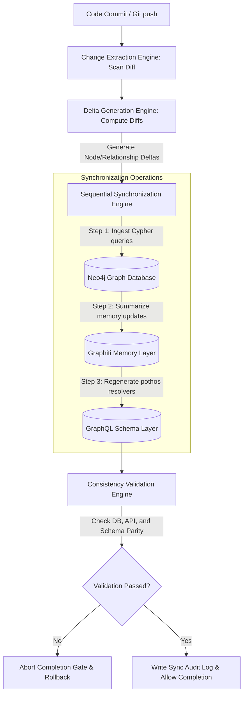

# Mandatory Synchronization Engine Architecture — Stayflexi Platform

This document describes the architectural layout, ingestion channels, delta processors, and gate controllers of the Mandatory Synchronization Engine.

---

## 1. High-Level Engine Pipeline

To prevent knowledge drift across the orchestrator, we enforce sequential synchronization of all knowledge domains on every task completion.

---

## 2. Engine Layer Specifications

### Change Extraction Engine

- **Purpose**: AST parsing and schema scanning to capture updates.
- **Workflow**: Compares current workspace code against git baseline commits to extract new, modified, or deleted feature files, REST paths, Prisma databases tables, and NPM packages dependencies.

### Delta Generation Engine

- **Purpose**: Calculates structural delta vectors.
- **Workflow**: Matches extracted code nodes to existing Neo4j graph nodes. Produces a machine-readable delta schema listing additions (`+`), removals (`-`), and modifications.

### Sequential Synchronization Engine

- **Purpose**: Enforces atomic updates across databases, semantic memories, and GraphQL subgraphs.
- **Workflow**: Dispatches Neo4j queries, triggers Graphiti ingestion blocks, and compiles GraphQL schemas in a single transactional sequence.

### Consistency Validation Engine

- **Purpose**: Multi-directional parity audit checking.
- **Workflow**: Audits schema hashes (e.g. database schema check vs Pothos types check) to confirm that no knowledge drift occurred.
